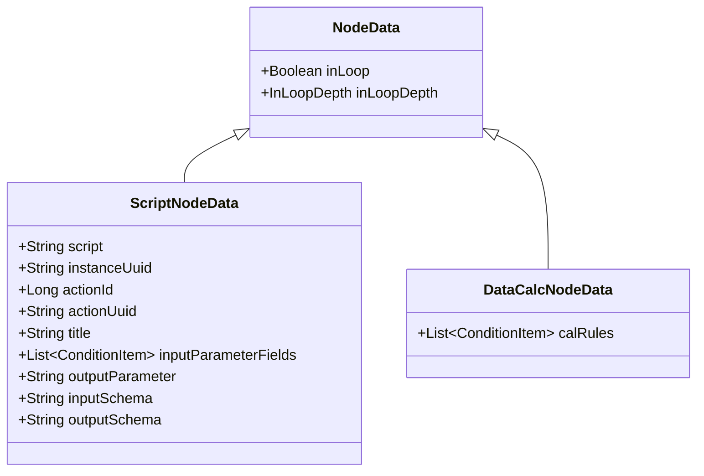
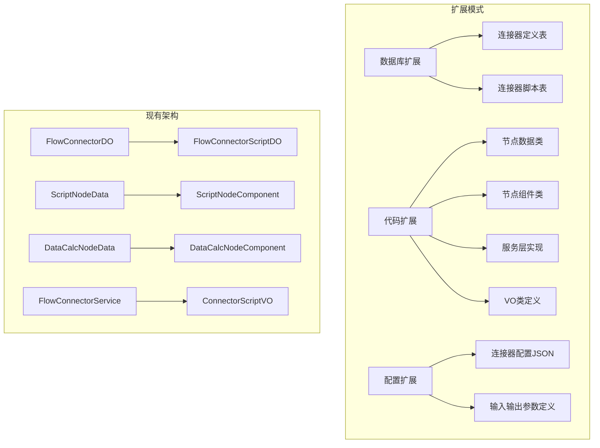

# Flow 连接器扩展开发方案

## 目录
1. [现有连接器架构分析](#1-现有连接器架构分析)
2. [连接器数据模型详解](#2-连接器数据模型详解)
3. [连接器扩展机制](#3-连接器扩展机制)
4. [163邮箱连接器开发方案](#4-163邮箱连接器开发方案)
5. [通用连接器开发框架](#5-通用连接器开发框架)
6. [实施步骤](#6-实施步骤)

---

## 1. 现有连接器架构分析

### 1.1 连接器数据模型

```mermaid
classDiagram
    class FlowConnectorDO {
        +String connectorUuid
        +String connectorName
        +String typeCode
        +String description
        +String config
    }
    
    class FlowConnectorScriptDO {
        +String scriptUuid
        +String connectorUuid
        +String scriptName
        +String scriptType
        +String rawScript
        +String inputParameter
        +String outputParameter
        +String inputSchema
        +String outputSchema
    }
    
    FlowConnectorDO ||--o{ FlowConnectorScriptDO : contains
```

### 1.2 节点数据模型

**关键发现**：连接器的数据模型不仅仅是数据库表，更重要的是**节点数据模型**：

#### 1.2.1 节点数据继承关系


#### 1.2.2 节点类型注解
```java
// 脚本节点
@NodeType("javascript")
public class ScriptNodeData extends NodeData

// 数据计算节点
@NodeType("dataCalc")
public class DataCalcNodeData extends NodeData

// 表单开始节点
@NodeType("startForm")
public class StartFormNodeData extends NodeData
```

**核心机制**：每个节点类型都有对应的：
1. **节点数据类**：继承 `NodeData`，用 `@NodeType("类型标识")` 注解
2. **节点组件类**：继承 `SkippableNodeComponent`，用 `@LiteflowComponent("类型标识")` 注解
3. **数据关联**：通过 `FlowGraphBuilder` 在运行时动态关联

### 1.3 连接器类型分析

当前系统中的连接器类型：

| 类型 | 标识符 | 节点数据类 | 节点组件类 | 说明 |
|------|---------|------------|------------|------|
| 脚本连接器 | `javascript` | [`ScriptNodeData`](onebase-module-flow/onebase-module-flow-context/src/main/java/com/cmsr/onebase/module/flow/context/graph/nodes/ScriptNodeData.java) | [`ScriptNodeComponent`](onebase-module-flow/onebase-module-flow-component/src/main/java/com/cmsr/onebase/module/flow/component/external/ScriptNodeComponent.java) | 通过外部 JS 服务器执行脚本 |
| 数据计算 | `dataCalc` | [`DataCalcNodeData`](onebase-module-flow/onebase-module-flow-component/src/main/java/com/cmsr/onebase/module/flow/component/external/DataCalcNodeData.java) | [`DataCalcNodeComponent`](onebase-module-flow/onebase-module-flow-component/src/main/java/com/cmsr/onebase/module/flow/component/external/DataCalcNodeComponent.java) | 数据计算和转换 |

**关键理解**：
- **节点数据类**：定义节点的数据结构和配置
- **节点组件类**：实现节点的执行逻辑
- **类型标识符**：两者通过相同的字符串标识符关联

### 1.4 连接器注册机制

```java
// 节点数据注册
@NodeType("javascript")
public class ScriptNodeData extends NodeData {
    // 定义节点数据结构
}

// 节点组件注册
@LiteflowComponent("javascript")  // 注册为 LiteFlow 组件
public class ScriptNodeComponent extends SkippableNodeComponent {
    // 实现执行逻辑
}
```

**注册流程**：
1. **双重注册**：
   - **节点数据类**：通过 `@NodeType("标识符")` 注解注册
   - **节点组件类**：通过 `@LiteflowComponent("标识符")` 注解注册
2. **数据关联**：通过 `FlowGraphBuilder` 在运行时根据节点类型查找对应的数据类
3. **动态执行**：LiteFlow 根据节点类型调用对应的组件类

---

## 2. 连接器数据模型详解

### 2.1 ScriptNodeData 深度分析

[`ScriptNodeData`](onebase-module-flow/onebase-module-flow-context/src/main/java/com/cmsr/onebase/module/flow/context/graph/nodes/ScriptNodeData.java) 是脚本连接器的核心数据模型：

```java
@NodeType("javascript")
public class ScriptNodeData extends NodeData implements Serializable {
    private String script;                    // 脚本内容（从数据库补充）
    private String instanceUuid;               // 实例UUID
    private Long actionId;                    // 动作ID（临时兼容策略）
    private String actionUuid;                  // 动作UUID
    private String title;                      // 标题
    private List<ConditionItem> inputParameterFields;  // 输入参数字段
    private String outputParameter;             // 输出参数
    private String inputSchema;                 // 输入参数模式
    private String outputSchema;                // 输出参数模式
}
```

**数据来源**：
1. **流程定义**：基础信息来自流程图 JSON 定义
2. **数据库补充**：`script`、`inputSchema`、`outputSchema` 从 `flow_connector_script` 表动态加载

### 2.2 DataCalcNodeData 分析

[`DataCalcNodeData`](onebase-module-flow/onebase-module-flow-component/src/main/java/com/cmsr/onebase/module/flow/component/external/DataCalcNodeData.java) 是数据计算节点的数据模型：

```java
@NodeType("dataCalc")
public class DataCalcNodeData extends NodeData implements Serializable {
    private List<ConditionItem> calRules;  // 计算规则列表
}
```

**特点**：
- 结构简单，主要包含计算规则
- 不依赖外部数据库，配置直接在流程定义中

### 2.3 数据加载机制

在 [`FlowGraphBuilder.traverseNodeAndEnrichData()`](onebase-module-flow/onebase-module-flow-core/src/main/java/com/cmsr/onebase/module/flow/core/graph/FlowGraphBuilder.java:80) 中：

```java
private void traverseNodeAndEnrichData(Long applicationId, JsonGraphNode node) {
    if (node.getData() instanceof ScriptNodeData scriptNodeData) {
        // 从数据库加载脚本内容
        FlowConnectorScriptDO connectorScriptDO = connectorScriptRepository.findByApplicationAndUuid(
            applicationId, scriptNodeData.getActionId(), scriptNodeData.getActionUuid());
        
        // 将数据库内容补充到节点数据中
        scriptNodeData.setScript(connectorScriptDO.getRawScript());
        scriptNodeData.setInputSchema(connectorScriptDO.getInputSchema());
        scriptNodeData.setOutputSchema(connectorScriptDO.getOutputSchema());
    }
    // 递归处理子节点
}
```

## 3. 连接器扩展机制

### 3.1 扩展点分析

基于现有架构，连接器扩展有以下几个关键点：

#### 3.1.1 数据库层面
- **连接器定义**：`flow_connector` 表存储连接器基本信息
- **连接器脚本**：`flow_connector_script` 表存储具体执行逻辑

#### 3.1.2 代码层面
- **节点数据类**：继承 `NodeData`，用 `@NodeType("标识符")` 注解
- **节点组件类**：继承 `SkippableNodeComponent`，用 `@LiteflowComponent("标识符")` 注解
- **服务层**：实现连接器的 CRUD 管理
- **数据传输**：定义连接器特有的配置和参数结构

#### 3.1.3 配置层面
- **连接器配置**：JSON 格式存储连接器全局配置
- **脚本配置**：输入输出参数定义和执行脚本

### 3.2 扩展模式



---

## 4. 163邮箱连接器开发方案

### 4.1 需求分析

#### 3.1.1 功能需求
- **发送邮件**：支持文本邮件、HTML邮件
- **附件支持**：支持单个或多个附件
- **收件人管理**：支持多个收件人、抄送、密送
- **模板支持**：支持邮件模板变量替换
- **发送状态**：返回发送结果和错误信息

#### 3.1.2 技术需求
- **163邮箱API**：集成163邮箱SMTP/HTTP API
- **认证机制**：支持账号密码或OAuth认证
- **错误处理**：网络异常、认证失败、发送失败等
- **重试机制**：支持发送失败重试

### 4.2 数据模型设计

#### 3.2.1 连接器定义
```json
{
  "connectorName": "163邮箱",
  "typeCode": "EMAIL_163",
  "description": "163邮箱发送连接器",
  "config": {
    "smtpHost": "smtp.163.com",
    "smtpPort": 465,
    "useSSL": true,
    "maxRetries": 3,
    "timeout": 30000
  }
}
```

#### 3.2.2 连接器脚本
```json
{
  "scriptName": "发送163邮件",
  "scriptType": "EMAIL_SEND",
  "description": "通过163邮箱发送邮件",
  "inputSchema": [
    {
      "fieldName": "to",
      "fieldType": "ARRAY",
      "fieldDesc": "收件人邮箱列表",
      "required": true
    },
    {
      "fieldName": "cc", 
      "fieldType": "ARRAY",
      "fieldDesc": "抄送邮箱列表",
      "required": false
    },
    {
      "fieldName": "subject",
      "fieldType": "STRING", 
      "fieldDesc": "邮件主题",
      "required": true
    },
    {
      "fieldName": "content",
      "fieldType": "TEXT",
      "fieldDesc": "邮件内容", 
      "required": true
    },
    {
      "fieldName": "attachments",
      "fieldType": "ARRAY",
      "fieldDesc": "附件列表",
      "required": false
    }
  ],
  "outputSchema": [
    {
      "fieldName": "messageId",
      "fieldType": "STRING",
      "fieldDesc": "邮件ID"
    },
    {
      "fieldName": "status",
      "fieldType": "STRING", 
      "fieldDesc": "发送状态"
    },
    {
      "fieldName": "errorMessage",
      "fieldType": "STRING",
      "fieldDesc": "错误信息"
    }
  ]
}
```

### 4.3 代码实现

#### 3.3.1 邮箱连接器组件

```java
package com.cmsr.onebase.module.flow.component.external;

import com.cmsr.onebase.module.flow.component.SkippableNodeComponent;
import com.cmsr.onebase.module.flow.context.ExecuteContext;
import com.cmsr.onebase.module.flow.context.VariableContext;
import com.yomahub.liteflow.annotation.LiteflowComponent;
import lombok.Setter;
import lombok.extern.slf4j.Slf4j;
import org.springframework.beans.factory.annotation.Autowired;
import org.springframework.stereotype.Component;

@Slf4j
@Setter
@LiteflowComponent("email163")  // 注册为 email163 组件
public class Email163NodeComponent extends SkippableNodeComponent {

    @Autowired
    private Email163Service email163Service;

    @Override
    public void process() throws Exception {
        // 1. 获取上下文
        ExecuteContext executeContext = this.getContextBean(ExecuteContext.class);
        executeContext.addLog("163邮箱节点开始执行");
        VariableContext variableContext = this.getContextBean(VariableContext.class);
        
        // 2. 获取输入参数
        Map<String, Object> inputParams = variableContext.getInputParams();
        Email163Request emailRequest = buildEmailRequest(inputParams);
        
        // 3. 执行邮件发送
        Email163Response response = email163Service.sendEmail(emailRequest);
        
        // 4. 处理结果
        Map<String, Object> outputParams = new HashMap<>();
        outputParams.put("messageId", response.getMessageId());
        outputParams.put("status", response.getStatus());
        outputParams.put("errorMessage", response.getErrorMessage());
        
        // 5. 设置输出参数
        variableContext.putNodeVariables(this.getTag(), outputParams);
        executeContext.addLog("163邮箱节点执行完成，状态: " + response.getStatus());
    }
    
    private Email163Request buildEmailRequest(Map<String, Object> inputParams) {
        Email163Request request = new Email163Request();
        request.setTo((List<String>) inputParams.get("to"));
        request.setCc((List<String>) inputParams.get("cc"));
        request.setSubject((String) inputParams.get("subject"));
        request.setContent((String) inputParams.get("content"));
        request.setAttachments((List<EmailAttachment>) inputParams.get("attachments"));
        return request;
    }
}
```

#### 3.3.2 邮箱服务实现

```java
package com.cmsr.onebase.module.flow.component.external;

import com.cmsr.onebase.module.flow.core.dal.dataobject.FlowConnectorDO;
import com.cmsr.onebase.module.flow.core.dal.database.FlowConnectorRepository;
import lombok.Setter;
import lombok.extern.slf4j.Slf4j;
import org.springframework.beans.factory.annotation.Autowired;
import org.springframework.stereotype.Service;

import javax.mail.*;
import javax.mail.internet.InternetAddress;
import javax.mail.internet.MimeMessage;
import java.util.Properties;

@Slf4j
@Setter
@Service
public class Email163Service {

    @Autowired
    private FlowConnectorRepository connectorRepository;
    
    public Email163Response sendEmail(Email163Request request) throws Exception {
        // 1. 获取连接器配置
        FlowConnectorDO connector = getConnectorConfig();
        Email163Config config = parseConfig(connector.getConfig());
        
        // 2. 创建邮件会话
        Session session = createMailSession(config);
        
        // 3. 创建邮件消息
        MimeMessage message = createMimeMessage(session, request);
        
        // 4. 发送邮件
        Transport transport = session.getTransport("smtp");
        transport.connect(config.getSmtpHost(), config.getSmtpPort(), 
                       config.getUsername(), config.getPassword());
        transport.sendMessage(message, message.getAllRecipients());
        transport.close();
        
        // 5. 返回结果
        return Email163Response.success("邮件发送成功", message.getMessageID());
    }
    
    private FlowConnectorDO getConnectorConfig() {
        return connectorRepository.findByTypeCodeAndApplicationId("EMAIL_163", getCurrentApplicationId());
    }
    
    private Session createMailSession(Email163Config config) {
        Properties props = new Properties();
        props.put("mail.smtp.host", config.getSmtpHost());
        props.put("mail.smtp.port", config.getSmtpPort());
        props.put("mail.smtp.auth", "true");
        props.put("mail.smtp.ssl.enable", config.isUseSSL());
        
        return Session.getInstance(props, new Authenticator() {
            protected PasswordAuthentication getPasswordAuthentication() {
                return new PasswordAuthentication(config.getUsername(), config.getPassword());
            }
        });
    }
}
```

### 4.4 配置管理

#### 3.4.1 连接器配置类

```java
package com.cmsr.onebase.module.flow.component.external;

import lombok.Data;

@Data
public class Email163Config {
    private String smtpHost;
    private Integer smtpPort;
    private Boolean useSSL;
    private String username;
    private String password;
    private Integer maxRetries;
    private Integer timeout;
}
```

#### 3.4.2 请求响应对象

```java
package com.cmsr.onebase.module.flow.component.external;

import lombok.Data;
import java.util.List;

@Data
public class Email163Request {
    private List<String> to;
    private List<String> cc;
    private List<String> bcc;
    private String subject;
    private String content;
    private List<EmailAttachment> attachments;
    private Boolean isHtml = false;
}

@Data
public class Email163Response {
    private String status;
    private String messageId;
    private String errorMessage;
    
    public static Email163Response success(String message, String messageId) {
        Email163Response response = new Email163Response();
        response.setStatus("SUCCESS");
        response.setMessageId(messageId);
        return response;
    }
    
    public static Email163Response error(String errorMessage) {
        Email163Response response = new Email163Response();
        response.setStatus("ERROR");
        response.setErrorMessage(errorMessage);
        return response;
    }
}
```

---

## 4. 通用连接器开发框架

### 4.1 抽象基类设计

```java
package com.cmsr.onebase.module.flow.component.external;

import com.cmsr.onebase.module.flow.component.SkippableNodeComponent;
import com.cmsr.onebase.module.flow.context.ExecuteContext;
import com.cmsr.onebase.module.flow.context.VariableContext;
import com.cmsr.onebase.module.flow.core.dal.dataobject.FlowConnectorDO;
import com.cmsr.onebase.module.flow.core.dal.database.FlowConnectorRepository;
import lombok.Setter;
import lombok.extern.slf4j.Slf4j;
import org.springframework.beans.factory.annotation.Autowired;

@Slf4j
@Setter
public abstract class BaseConnectorNodeComponent extends SkippableNodeComponent {

    @Autowired
    private FlowConnectorRepository connectorRepository;
    
    @Override
    public final void process() throws Exception {
        // 1. 获取上下文
        ExecuteContext executeContext = this.getContextBean(ExecuteContext.class);
        executeContext.addLog(getConnectorType() + "连接器开始执行");
        VariableContext variableContext = this.getContextBean(VariableContext.class);
        
        // 2. 获取连接器配置
        FlowConnectorDO connector = getConnectorConfig();
        ConnectorConfig config = parseConnectorConfig(connector.getConfig());
        
        // 3. 构建请求对象
        ConnectorRequest request = buildRequest(variableContext.getInputParams());
        
        // 4. 执行连接器逻辑
        ConnectorResponse response = executeConnector(config, request);
        
        // 5. 处理执行结果
        handleResponse(executeContext, variableContext, response);
    }
    
    // 抽象方法，由具体连接器实现
    protected abstract String getConnectorType();
    protected abstract ConnectorConfig parseConnectorConfig(String configJson);
    protected abstract ConnectorRequest buildRequest(Map<String, Object> inputParams);
    protected abstract ConnectorResponse executeConnector(ConnectorConfig config, ConnectorRequest request);
    
    // 通用方法
    protected FlowConnectorDO getConnectorConfig() {
        return connectorRepository.findByTypeCodeAndApplicationId(
            getConnectorType(), getCurrentApplicationId());
    }
    
    protected void handleResponse(ExecuteContext executeContext, VariableContext variableContext, ConnectorResponse response) {
        Map<String, Object> outputParams = response.toOutputParams();
        variableContext.putNodeVariables(this.getTag(), outputParams);
        executeContext.addLog(getConnectorType() + "连接器执行完成，状态: " + response.getStatus());
    }
    
    protected Long getCurrentApplicationId() {
        // 从上下文获取当前应用ID
        ExecuteContext executeContext = this.getContextBean(ExecuteContext.class);
        return executeContext.getApplicationId();
    }
}
```

### 4.2 连接器接口定义

```java
package com.cmsr.onebase.module.flow.component.external;

// 连接器配置接口
public interface ConnectorConfig {
    boolean validate();
    String getConfigType();
}

// 连接器请求接口
public interface ConnectorRequest {
    Map<String, Object> toMap();
    boolean validate();
}

// 连接器响应接口
public interface ConnectorResponse {
    String getStatus();
    String getErrorMessage();
    Map<String, Object> toOutputParams();
}
```

### 4.3 连接器工厂模式

```java
package com.cmsr.onebase.module.flow.component.external;

import org.springframework.beans.factory.annotation.Autowired;
import org.springframework.stereotype.Component;

import java.util.Map;
import java.util.concurrent.ConcurrentHashMap;

@Component
public class ConnectorFactory {
    
    @Autowired
    private ApplicationContext applicationContext;
    
    private Map<String, BaseConnectorNodeComponent> connectorCache = new ConcurrentHashMap<>();
    
    public BaseConnectorNodeComponent getConnector(String typeCode) {
        return connectorCache.computeIfAbsent(typeCode, k -> {
            String beanName = k.toLowerCase() + "Connector";
            return applicationContext.getBean(beanName, BaseConnectorNodeComponent.class);
        });
    }
}
```

---

## 5. 实施步骤

### 5.1 第一阶段：基础架构（1-2天）

#### 5.1.1 数据库扩展
```sql
-- 添加连接器类型枚举
INSERT INTO flow_connector (connector_name, type_code, description, config) VALUES 
('163邮箱', 'EMAIL_163', '163邮箱发送连接器', '{"smtpHost":"smtp.163.com","smtpPort":465,"useSSL":true}');

-- 添加连接器脚本
INSERT INTO flow_connector_script (connector_uuid, script_name, script_type, description, raw_script, input_schema, output_schema) VALUES 
('uuid-163-email', '发送163邮件', 'EMAIL_SEND', '通过163邮箱发送邮件', '...', '[...]', '[...]');
```

#### 5.1.2 基础代码结构
- 创建 `Email163NodeComponent` 类
- 创建 `Email163Service` 服务类
- 创建配置和请求响应对象

### 5.2 第二阶段：核心功能（2-3天）

#### 5.2.1 邮件发送实现
- 实现 SMTP 连接和认证
- 实现邮件消息构建
- 实现附件处理
- 实现错误处理和重试

#### 5.2.2 集成测试
- 单元测试邮件发送
- 集成测试流程执行
- 错误场景测试

### 5.3 第三阶段：管理界面（1-2天）

#### 5.3.1 连接器管理
- 扩展 [`FlowConnectorController`](onebase-module-flow/onebase-module-flow-build/src/main/java/com/cmsr/onebase/module/flow/build/controller/FlowConnectorController.java)
- 添加邮箱连接器配置界面
- 添加邮箱模板管理

#### 5.3.2 脚本管理
- 扩展 [`FlowConnectorScriptController`](onebase-module-flow/onebase-module-flow-build/src/main/java/com/cmsr/onebase/module/flow/build/controller/FlowConnectorScriptController.java)
- 添加邮箱脚本模板
- 添加参数配置界面

### 5.4 第四阶段：扩展框架（2-3天）

#### 5.4.1 通用框架
- 实现 `BaseConnectorNodeComponent` 抽象类
- 实现 `ConnectorFactory` 工厂类
- 定义标准接口和配置格式

#### 5.4.2 其他连接器
- 基于163邮箱经验，快速实现QQ邮箱
- 设计短信连接器接口
- 设计数据库连接器接口

### 5.5 第五阶段：文档和培训（1天）

#### 5.5.1 开发文档
- 连接器开发指南
- API 接口文档
- 配置说明文档

#### 5.5.2 使用示例
- 创建示例流程
- 提供测试用例
- 录制演示视频

---

## 6. 风险评估与应对

### 6.1 技术风险

| 风险 | 影响 | 概率 | 应对措施 |
|------|------|------|----------|
| 邮箱API变更 | 高 | 中 | 封装API适配层，支持多版本 |
| 网络连接问题 | 中 | 高 | 实现重试机制和超时控制 |
| 认证安全问题 | 高 | 低 | 支持多种认证方式，加密存储密码 |

### 6.2 业务风险

| 风险 | 影响 | 概率 | 应对措施 |
|------|------|------|----------|
| 邮件发送失败 | 高 | 中 | 实现发送状态跟踪和失败重试 |
| 性能瓶颈 | 中 | 低 | 异步发送，批量处理优化 |
| 配置复杂 | 低 | 中 | 提供配置模板和验证机制 |

---

## 7. 成功标准

### 7.1 功能标准
- ✅ 成功发送163邮件
- ✅ 支持附件和HTML格式
- ✅ 提供完整的错误处理
- ✅ 集成到流程编辑器

### 7.2 性能标准
- ✅ 单封邮件发送时间 < 3秒
- ✅ 支持并发发送
- ✅ 内存使用合理

### 7.3 可扩展性标准
- ✅ 基于163邮箱经验，快速扩展其他邮箱
- ✅ 提供通用的连接器开发框架
- ✅ 支持插件化部署

---

## 总结

本方案基于现有 Flow 模块的连接器架构，参考 `ScriptNodeComponent` 的实现模式，设计了163邮箱连接器的完整开发方案。通过分阶段实施，可以快速验证技术可行性，并逐步完善功能。同时设计了通用的连接器开发框架，为后续扩展其他类型的连接器（QQ邮箱、短信、数据库等）奠定基础。