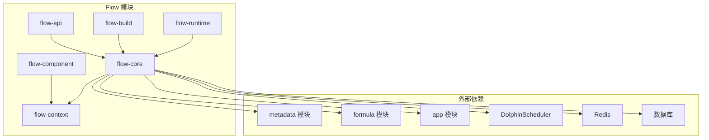
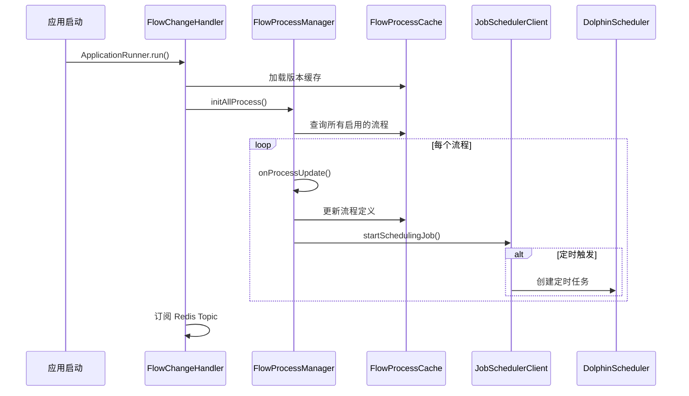
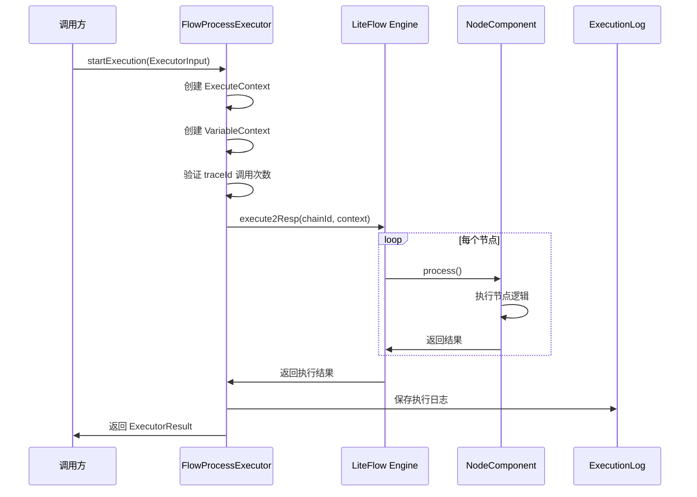

# OneBase Module Flow 模块学习指南

## 目录
1. [模块功能概述](#1-模块功能概述)
2. [模块依赖与业务逻辑](#2-模块依赖与业务逻辑)
3. [运行机制](#3-运行机制)
4. [接口调试指南](#4-接口调试指南)
5. [代码走读路径](#5-代码走读路径)
6. [最新功能：子表数据处理](#6-最新功能子表数据处理)

---

## 1. 模块功能概述

### 1.1 核心功能
`onebase-module-flow` 是一个**自动化工作流管理模块**，基于 **LiteFlow** 流程引擎实现，提供可视化的流程编排和执行能力。

### 1.2 主要特性
- **可视化流程编排**：支持通过前端界面拖拽式创建流程
- **多种触发方式**：
  - 实体触发（Entity Trigger）：当实体数据变更时触发
  - 定时触发（Time Trigger）：基于 Cron 表达式的定时任务
  - 日期字段触发（Date Field Trigger）：基于实体日期字段的定时触发
  - 表单触发（Form Trigger）：通过前端表单操作触发
- **丰富的节点类型**：
  - 开始节点：StartEntity、StartForm、StartTime、StartDateField
  - 逻辑节点：IfCase、Loop、SwitchCondition
  - 外部节点：DataCalc、Script
  - 系统节点：NoOp
- **版本管理**：支持编辑态（versionTag=0）和运行态（versionTag=1）的数据隔离
- **分布式执行**：基于 Redis 实现分布式锁和消息通知
- **执行日志**：完整的流程执行日志记录

### 1.3 模块结构
```
onebase-module-flow/
├── onebase-module-flow-api/          # API 接口定义
├── onebase-module-flow-core/         # 核心业务逻辑
├── onebase-module-flow-build/        # 流程构建管理
├── onebase-module-flow-runtime/      # 流程运行时
├── onebase-module-flow-component/    # 流程节点组件
└── onebase-module-flow-context/     # 上下文和数据模型
```

---

## 2. 模块依赖与业务逻辑

### 2.1 模块依赖关系



### 2.2 直接业务逻辑

#### 2.2.1 实体触发流程
```
实体数据变更 
  → FlowProcessExecApiImpl.entityTrigger()
  → 查找匹配的 StartEntity 节点
  → 验证触发事件和过滤条件
  → FlowProcessExecutor.startExecution()
  → LiteFlow 执行流程
  → 返回执行结果
```

**关键代码路径**：
- [`FlowProcessExecApiImpl.entityTrigger()`](onebase-module-flow/onebase-module-flow-core/src/main/java/com/cmsr/onebase/module/flow/core/impl/FlowProcessExecApiImpl.java:49)
- [`FlowProcessExecutor.startExecution()`](onebase-module-flow/onebase-module-flow-core/src/main/java/com/cmsr/onebase/module/flow/core/flow/FlowProcessExecutor.java:67)

#### 2.2.2 定时触发流程
```
应用启动/流程更新
  → FlowChangeHandler.run()
  → FlowProcessManager.initAllProcess()
  → FlowProcessManager.startSchedulingJob()
  → JobSchedulerClient.startJob()
  → DolphinScheduler 创建定时任务
  → 定时触发时调用 FlowRemoteCallController
  → FlowProcessExecutor.startExecution()
```

**关键代码路径**：
- [`FlowChangeHandler.run()`](onebase-module-flow/onebase-module-flow-core/src/main/java/com/cmsr/onebase/module/flow/core/handler/FlowChangeHandler.java:53)
- [`FlowProcessManager.startSchedulingJob()`](onebase-module-flow/onebase-module-flow-core/src/main/java/com/cmsr/onebase/module/flow/core/graph/FlowProcessManager.java:213)
- [`JobSchedulerClient.startJob()`](onebase-module-flow/onebase-module-flow-core/src/main/java/com/cmsr/onebase/module/flow/core/job/JobSchedulerClient.java:42)

#### 2.2.3 表单触发流程
```
前端表单操作
  → FlowProcessExecController.triggerForm()
  → FlowProcessExecService.triggerForm()
  → 查找匹配的 StartForm 节点
  → FlowProcessExecutor.startExecution()
  → LiteFlow 执行流程
```

**关键代码路径**：
- [`FlowProcessExecController.triggerForm()`](onebase-module-flow/onebase-module-flow-runtime/src/main/java/com/cmsr/onebase/module/flow/runtime/controller/FlowProcessExecController.java:46)

### 2.3 与其他模块的交互

#### 2.3.1 与 Metadata 模块
- **用途**：获取实体字段类型、语义信息
- **接口**：`FlowFieldTypeProvider`、`FlowAppProvider`
- **代码位置**：[`FlowFieldTypeProviderImpl`](onebase-module-flow/onebase-module-flow-core/src/main/java/com/cmsr/onebase/module/flow/core/external/FlowFlowFieldTypeProviderImpl.java)

#### 2.3.2 与 Formula 模块
- **用途**：执行公式计算
- **交互方式**：通过 RPC 调用公式引擎

#### 2.3.3 与 App 模块
- **用途**：获取应用信息、页面信息
- **接口**：`FlowAppProvider`

---

## 3. 运行机制

### 3.1 启动流程



### 3.2 运行方式

#### 3.2.1 定时任务（DolphinScheduler）
- **触发类型**：TIME、DATE_FIELD
- **实现方式**：通过 [`JobSchedulerClient`](onebase-module-flow/onebase-module-flow-core/src/main/java/com/cmsr/onebase/module/flow/core/job/JobSchedulerClient.java) 调用 DolphinScheduler API
- **配置**：
  ```yaml
  onebase:
    scheduler:
      flow-project: 123456  # DolphinScheduler 项目编码
      flow-url: http://localhost:8080/flow/remote/call  # 回调地址
  ```

#### 3.2.2 事件驱动（Redis Pub/Sub）
- **触发类型**：ENTITY、FORM
- **实现方式**：
  - 通过 Redis Topic 发布变更事件
  - [`FlowChangeHandler`](onebase-module-flow/onebase-module-flow-core/src/main/java/com/cmsr/onebase/module/flow/core/handler/FlowChangeHandler.java) 监听事件并更新流程缓存
- **定时检查**：每 60 秒检查一次版本缓存，每 300 秒检查一次定时任务

#### 3.2.3 直接调用（HTTP API）
- **触发类型**：FORM、手动触发
- **实现方式**：通过 REST API 直接调用执行接口

### 3.3 流程执行流程



### 3.4 版本管理机制

- **编辑态（versionTag=0）**：流程编辑时的数据
- **运行态（versionTag=1）**：流程发布后的数据
- **切换机制**：
  - 发布：`copyEditToRuntime()` - 将编辑态数据复制到运行态
  - 备份：`moveRuntimeToHistory()` - 将运行态数据备份
  - 删除：`deleteRuntimeData()` - 删除运行态数据

**代码位置**：[`FlowDataManager`](onebase-module-flow/onebase-module-flow-api/src/main/java/com/cmsr/onebase/module/flow/api/FlowDataManager.java)

---

## 4. 接口调试指南

### 4.1 流程管理接口（Build 模块）

#### 4.1.1 创建流程
```http
POST /flow/mgmt/create
Content-Type: application/json

{
  "applicationId": 1,
  "processName": "测试流程",
  "processDescription": "这是一个测试流程",
  "triggerType": "ENTITY",
  "processDefinition": "{\"nodes\":[...]}"
}
```

**Controller**：[`FlowProcessMgmtController.create()`](onebase-module-flow/onebase-module-flow-build/src/main/java/com/cmsr/onebase/module/flow/build/controller/FlowProcessMgmtController.java:52)

#### 4.1.2 更新流程定义
```http
POST /flow/mgmt/update-definition
Content-Type: application/json

{
  "id": 1,
  "processDefinition": "{\"nodes\":[...]}"
}
```

#### 4.1.3 启用/禁用流程
```http
POST /flow/mgmt/enable?id=1
POST /flow/mgmt/disable?id=1
```

#### 4.1.4 Cron 表达式解析
```http
GET /flow/mgmt/cron-parse?cron=0 0 12 * * ?
```

### 4.2 流程执行接口（Runtime 模块）

#### 4.2.1 查询表单触发列表
```http
GET /flow/exec/form/query?pageId=1
```

**Controller**：[`FlowProcessExecController.queryFormTrigger()`](onebase-module-flow/onebase-module-flow-runtime/src/main/java/com/cmsr/onebase/module/flow/runtime/controller/FlowProcessExecController.java:38)

#### 4.2.2 触发表单
```http
POST /flow/exec/form/trigger
Content-Type: application/json

{
  "pageId": 1,
  "formData": {
    "field1": "value1",
    "field2": "value2"
  },
  "traceId": "trace-123456"
}
```

#### 4.2.3 查询流程列表
```http
GET /flow/exec/flow-handler/get
```

### 4.3 RPC 接口（API 模块）

#### 4.3.1 实体触发
```java
EntityTriggerReqDTO reqDTO = new EntityTriggerReqDTO();
reqDTO.setApplicationId(1L);
reqDTO.setTableName("customer");
reqDTO.setTriggerEvent(TriggerEventEnum.AFTER_INSERT);
reqDTO.setTraceId("trace-123456");
reqDTO.setRowData(Map.of("id", 1, "name", "张三"));

EntityTriggerRespDTO resp = flowProcessExecApi.entityTrigger(reqDTO);
```

**接口**：[`FlowProcessExecApi.entityTrigger()`](onebase-module-flow/onebase-module-flow-api/src/main/java/com/cmsr/onebase/module/flow/api/FlowProcessExecApi.java:12)

### 4.4 调试步骤

#### 步骤 1：准备测试数据
1. 创建一个测试应用
2. 创建测试实体（如 customer）
3. 创建测试流程

#### 步骤 2：创建流程
```bash
curl -X POST http://localhost:8080/flow/mgmt/create \
  -H "Content-Type: application/json" \
  -d '{
    "applicationId": 1,
    "processName": "测试实体触发流程",
    "triggerType": "ENTITY",
    "processDefinition": "{\"nodes\":[{\"id\":\"start1\",\"type\":\"start_entity\",\"data\":{\"entityName\":\"customer\",\"triggerEvents\":[\"AFTER_INSERT\"]}}]}"
  }'
```

#### 步骤 3：启用流程
```bash
curl -X POST http://localhost:8080/flow/mgmt/enable?id=1
```

#### 步骤 4：触发流程
```bash
curl -X POST http://localhost:8080/flow/exec/form/trigger \
  -H "Content-Type: application/json" \
  -d '{
    "pageId": 1,
    "formData": {"name": "张三"},
    "traceId": "test-trace-001"
  }'
```

#### 步骤 5：查看执行日志
```sql
SELECT * FROM flow_execution_log 
WHERE trace_id = 'test-trace-001' 
ORDER BY start_time DESC 
LIMIT 10;
```

### 4.5 常见问题排查

#### 问题 1：流程未触发
- 检查流程是否启用：`enable_status = 1`
- 检查版本标签：`version_tag = 1`（运行态）
- 检查触发事件是否匹配
- 检查过滤条件是否满足

#### 问题 2：定时任务未执行
- 检查 DolphinScheduler 任务状态
- 检查 `flow_process_time` 表中的 `job_status`
- 检查 Cron 表达式是否正确

#### 问题 3：执行失败
- 查看 `flow_execution_log` 表的错误信息
- 检查节点配置是否正确
- 检查依赖服务是否正常

---

## 5. 代码走读路径

### 5.1 推荐学习路径

#### 阶段 1：理解核心概念（1-2 天）
1. **阅读模块结构**
   - [`pom.xml`](onebase-module-flow/pom.xml) - 了解模块划分
   - [`FlowProperties`](onebase-module-flow/onebase-module-flow-core/src/main/java/com/cmsr/onebase/module/flow/core/config/FlowProperties.java) - 理解版本标签

2. **理解数据模型**
   - [`FlowProcessDO`](onebase-module-flow/onebase-module-flow-core/src/main/java/com/cmsr/onebase/module/flow/core/dal/dataobject/FlowProcessDO.java) - 流程定义
   - [`FlowExecutionLogDO`](onebase-module-flow/onebase-module-flow-core/src/main/java/com/cmsr/onebase/module/flow/core/dal/dataobject/FlowExecutionLogDO.java) - 执行日志
   - [`JsonGraph`](onebase-module-flow/onebase-module-flow-context/src/main/java/com/cmsr/onebase/module/flow/context/graph/JsonGraph.java) - 流程图结构

3. **理解上下文**
   - [`ExecuteContext`](onebase-module-flow/onebase-module-flow-context/src/main/java/com/cmsr/onebase/module/flow/context/ExecuteContext.java) - 执行上下文
   - [`VariableContext`](onebase-module-flow/onebase-module-flow-context/src/main/java/com/cmsr/onebase/module/flow/context/VariableContext.java) - 变量上下文

#### 阶段 2：理解流程执行（2-3 天）
1. **流程执行器**
   - [`FlowProcessExecutor.startExecution()`](onebase-module-flow/onebase-module-flow-core/src/main/java/com/cmsr/onebase/module/flow/core/flow/FlowProcessExecutor.java:67) - 新流程执行
   - [`FlowProcessExecutor.resumeExecution()`](onebase-module-flow/onebase-module-flow-core/src/main/java/com/cmsr/onebase/module/flow/core/flow/FlowProcessExecutor.java:135) - 恢复流程执行

2. **流程管理器**
   - [`FlowProcessManager.initAllProcess()`](onebase-module-flow/onebase-module-flow-core/src/main/java/com/cmsr/onebase/module/flow/core/graph/FlowProcessManager.java:77) - 初始化所有流程
   - [`FlowProcessManager.onProcessUpdate()`](onebase-module-flow/onebase-module-flow-core/src/main/java/com/cmsr/onebase/module/flow/core/graph/FlowProcessManager.java:175) - 流程更新处理

3. **流程缓存**
   - [`FlowProcessCache`](onebase-module-flow/onebase-module-flow-core/src/main/java/com/cmsr/onebase/module/flow/core/graph/FlowProcessCache.java) - 流程缓存管理

#### 阶段 3：理解触发机制（2-3 天）
1. **实体触发**
   - [`FlowProcessExecApiImpl.entityTrigger()`](onebase-module-flow/onebase-module-flow-core/src/main/java/com/cmsr/onebase/module/flow/core/impl/FlowProcessExecApiImpl.java:49) - 实体触发入口

2. **定时任务**
   - [`JobSchedulerClient.startJob()`](onebase-module-flow/onebase-module-flow-core/src/main/java/com/cmsr/onebase/module/flow/core/job/JobSchedulerClient.java:42) - 创建定时任务
   - [`FlowChangeHandler`](onebase-module-flow/onebase-module-flow-core/src/main/java/com/cmsr/onebase/module/flow/core/handler/FlowChangeHandler.java) - 变更处理器

3. **表单触发**
   - [`FlowProcessExecService.triggerForm()`](onebase-module-flow/onebase-module-flow-runtime/src/main/java/com/cmsr/onebase/module/flow/runtime/service/FlowProcessExecServiceImpl.java) - 表单触发服务

#### 阶段 4：理解节点组件（3-4 天）
1. **开始节点**
   - [`StartEntityNodeComponent`](onebase-module-flow/onebase-module-flow-component/src/main/java/com/cmsr/onebase/module/flow/component/start/StartEntityNodeComponent.java)
   - [`StartFormNodeComponent`](onebase-module-flow/onebase-module-flow-component/src/main/java/com/cmsr/onebase/module/flow/component/start/StartFormNodeComponent.java)
   - [`StartTimeNodeComponent`](onebase-module-flow/onebase-module-flow-component/src/main/java/com/cmsr/onebase/module/flow/component/start/StartTimeNodeComponent.java)

2. **逻辑节点**
   - [`IfCaseNodeComponent`](onebase-module-flow/onebase-module-flow-component/src/main/java/com/cmsr/onebase/module/flow/component/logic/IfCaseNodeComponent.java)
   - [`LoopNodeComponent`](onebase-module-flow/onebase-module-flow-component/src/main/java/com/cmsr/onebase/module/flow/component/logic/LoopNodeComponent.java)
   - [`SwitchConditionNodeComponent`](onebase-module-flow/onebase-module-flow-component/src/main/java/com/cmsr/onebase/module/flow/component/logic/SwitchConditionNodeComponent.java)

3. **外部节点**
   - [`DataCalcNodeComponent`](onebase-module-flow/onebase-module-flow-component/src/main/java/com/cmsr/onebase/module/flow/component/external/DataCalcNodeComponent.java)
   - [`ScriptNodeComponent`](onebase-module-flow/onebase-module-flow-component/src/main/java/com/cmsr/onebase/module/flow/component/external/ScriptNodeComponent.java)

#### 阶段 5：理解管理接口（1-2 天）
1. **流程管理**
   - [`FlowProcessMgmtController`](onebase-module-flow/onebase-module-flow-build/src/main/java/com/cmsr/onebase/module/flow/build/controller/FlowProcessMgmtController.java) - 流程管理接口
   - [`FlowProcessMgmtService`](onebase-module-flow/onebase-module-flow-build/src/main/java/com/cmsr/onebase/module/flow/build/service/FlowProcessMgmtService.java) - 流程管理服务

2. **执行日志**
   - [`FlowExecutionLogController`](onebase-module-flow/onebase-module-flow-build/src/main/java/com/cmsr/onebase/module/flow/build/controller/FlowExecutionLogController.java) - 执行日志接口

### 5.2 关键代码文件清单

#### 核心执行流程
| 文件路径 | 说明 | 优先级 |
|---------|------|--------|
| `onebase-module-flow-core/src/main/java/com/cmsr/onebase/module/flow/core/flow/FlowProcessExecutor.java` | 流程执行器 | ⭐⭐⭐⭐⭐ |
| `onebase-module-flow-core/src/main/java/com/cmsr/onebase/module/flow/core/graph/FlowProcessManager.java` | 流程管理器 | ⭐⭐⭐⭐⭐ |
| `onebase-module-flow-core/src/main/java/com/cmsr/onebase/module/flow/core/graph/FlowProcessCache.java` | 流程缓存 | ⭐⭐⭐⭐ |
| `onebase-module-flow-core/src/main/java/com/cmsr/onebase/module/flow/core/graph/FlowGraphBuilder.java` | 流程图构建器 | ⭐⭐⭐⭐ |

#### 触发机制
| 文件路径 | 说明 | 优先级 |
|---------|------|--------|
| `onebase-module-flow-core/src/main/java/com/cmsr/onebase/module/flow/core/impl/FlowProcessExecApiImpl.java` | 实体触发实现 | ⭐⭐⭐⭐⭐ |
| `onebase-module-flow-core/src/main/java/com/cmsr/onebase/module/flow/core/job/JobSchedulerClient.java` | 定时任务客户端 | ⭐⭐⭐⭐ |
| `onebase-module-flow-core/src/main/java/com/cmsr/onebase/module/flow/core/handler/FlowChangeHandler.java` | 变更处理器 | ⭐⭐⭐⭐ |

#### 节点组件
| 文件路径 | 说明 | 优先级 |
|---------|------|--------|
| `onebase-module-flow-component/src/main/java/com/cmsr/onebase/module/flow/component/start/StartEntityNodeComponent.java` | 实体开始节点 | ⭐⭐⭐⭐ |
| `onebase-module-flow-component/src/main/java/com/cmsr/onebase/module/flow/component/logic/IfCaseNodeComponent.java` | 条件判断节点 | ⭐⭐⭐⭐ |
| `onebase-module-flow-component/src/main/java/com/cmsr/onebase/module/flow/component/external/DataCalcNodeComponent.java` | 数据计算节点 | ⭐⭐⭐⭐ |

#### 数据模型
| 文件路径 | 说明 | 优先级 |
|---------|------|--------|
| `onebase-module-flow-context/src/main/java/com/cmsr/onebase/module/flow/context/ExecuteContext.java` | 执行上下文 | ⭐⭐⭐⭐ |
| `onebase-module-flow-context/src/main/java/com/cmsr/onebase/module/flow/context/VariableContext.java` | 变量上下文 | ⭐⭐⭐⭐ |
| `onebase-module-flow-context/src/main/java/com/cmsr/onebase/module/flow/context/graph/JsonGraph.java` | 流程图模型 | ⭐⭐⭐ |

### 5.3 调试技巧

#### 1. 启用调试日志
```yaml
logging:
  level:
    com.cmsr.onebase.module.flow: DEBUG
    com.yomahub.liteflow: DEBUG
```

#### 2. 断点设置
- **流程执行入口**：`FlowProcessExecutor.startExecution()` 第 67 行
- **节点执行入口**：`NodeComponent.process()` 方法
- **触发入口**：`FlowProcessExecApiImpl.entityTrigger()` 第 49 行

#### 3. 查看流程缓存
```java
// 在 FlowProcessCache 中添加断点
FlowProcessCache cache = FlowProcessCache.getInstance();
Map<String, NodeData> nodeData = cache.findNodeData(processId);
```

#### 4. 查看执行日志
```sql
-- 查看最近的执行记录
SELECT * FROM flow_execution_log 
ORDER BY start_time DESC 
LIMIT 20;

-- 查看特定流程的执行记录
SELECT * FROM flow_execution_log 
WHERE process_id = 1 
ORDER BY start_time DESC;
```

### 5.4 实践建议

#### 建议 1：从简单流程开始
1. 创建一个只有开始节点和结束节点的简单流程
2. 触发执行，观察日志
3. 逐步添加逻辑节点，理解执行流程

#### 建议 2：使用单元测试
查看测试用例：
- `onebase-module-flow-core/src/test/resources/graphjson/` - 流程定义示例
- `simple.json` - 简单流程
- `loop.json` - 循环流程
- `switch.json` - 条件分支流程

#### 建议 3：阅读 LiteFlow 文档
Flow 模块基于 LiteFlow 引擎，建议先了解 LiteFlow 的基本概念：
- Chain（链）
- Component（组件）
- Context（上下文）

---

## 附录

### A. 数据库表结构

#### flow_process（流程定义表）
| 字段 | 类型 | 说明 |
|------|------|------|
| id | BIGINT | 主键 |
| process_uuid | VARCHAR | 流程 UUID |
| process_name | VARCHAR | 流程名称 |
| process_definition | TEXT | 流程定义 JSON |
| trigger_type | VARCHAR | 触发类型 |
| enable_status | INT | 启用状态 |
| publish_status | INT | 发布状态 |
| version_tag | INT | 版本标签 |

#### flow_execution_log（执行日志表）
| 字段 | 类型 | 说明 |
|------|------|------|
| id | BIGINT | 主键 |
| process_id | BIGINT | 流程 ID |
| trace_id | VARCHAR | 追踪 ID |
| execution_uuid | VARCHAR | 执行 UUID |
| execution_result | INT | 执行结果 |
| log_text | TEXT | 日志文本 |
| start_time | DATETIME | 开始时间 |
| end_time | DATETIME | 结束时间 |
| duration_time | BIGINT | 执行时长（毫秒） |

### B. 枚举值说明

#### FlowTriggerTypeEnum（触发类型）
- `ENTITY` - 实体触发
- `TIME` - 定时触发
- `DATE_FIELD` - 日期字段触发
- `FORM` - 表单触发

#### FlowEnableStatusEnum（启用状态）
- `0` - 禁用
- `1` - 启用

#### FlowPublishStatusEnum（发布状态）
- `0` - 编辑态
- `1` - 已发布

#### TriggerEventEnum（触发事件）
- `BEFORE_INSERT` - 插入前
- `AFTER_INSERT` - 插入后
- `BEFORE_UPDATE` - 更新前
- `AFTER_UPDATE` - 更新后
- `BEFORE_DELETE` - 删除前
- `AFTER_DELETE` - 删除后

### C. 配置参数

```yaml
# Flow 模块配置
lite-flow:
  version-tag: runtime  # runtime 或 build

# DolphinScheduler 配置
onebase:
  scheduler:
    flow-project: 123456
    flow-url: http://localhost:8080/flow/remote/call
```

---

## 总结

`onebase-module-flow` 是一个功能强大的自动化工作流管理模块，通过本学习指南，你应该能够：

1. ✅ 理解模块的核心功能和架构
2. ✅ 掌握模块与其他模块的交互关系
3. ✅ 理解流程的运行机制（定时任务、事件驱动、直接调用）
4. ✅ 能够通过接口进行调试和测试
5. ✅ 按照推荐路径进行代码走读

**下一步建议**：
- 实践创建和执行一个简单流程
- 阅读单元测试用例
- 尝试添加自定义节点组件
- 深入研究 LiteFlow 引擎的高级特性

祝你学习顺利！🎉