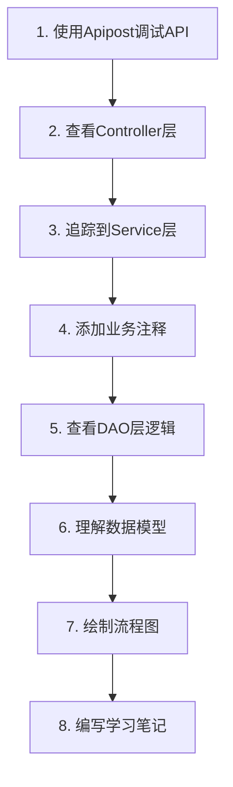

# OneBase v3.0 优化学习路径

**制定日期**: 2026-01-01  
**制定者**: Kanten (Claude Code)  
**学习周期**: 10天  
**学习方法**: API驱动 + 源码阅读 + 实践操作

---

## 📋 目录

1. [学习思路分析](#学习思路分析)
2. [三阶段学习法](#三阶段学习法)
3. [API驱动的学习方法](#api驱动的学习方法)
4. [模块学习优先级](#模块学习优先级)
5. [学习检查清单](#学习检查清单)
6. [学习建议和最佳实践](#学习建议和最佳实践)

---

## 学习思路分析

### ✅ 你的思路优点

1. **实践导向** - 通过API调试快速理解业务功能
2. **自顶向下** - 从Controller到Service再到DAO，符合调用链路
3. **注释学习** - 在Service层添加注释有助于理解业务逻辑
4. **循序渐进** - 从简单到复杂，逐步深入

### ⚠️ 需要改进的地方

1. **缺乏框架层基础** - 直接从业务模块开始，可能难以理解ORM、多租户等核心机制
2. **模块顺序问题** - 9个模块有依赖关系，需要按优先级学习
3. **学习效率** - 逐个模块学习可能耗时较长，建议按功能分组学习

### 🎯 优化方案

采用**"三阶段学习法"**，结合你的API调试思路：

```
阶段一：框架层基础（Day 2-3）
  ↓ 理解核心框架，为后续模块学习打基础

阶段二：核心业务模块（Day 4-7）
  ↓ 掌握核心业务逻辑，使用API调试辅助理解

阶段三：辅助模块（Day 8-10）
  ↓ 了解辅助功能，完善知识体系
```

---

## 三阶段学习法

### 阶段一：框架层基础（Day 2-3）

#### 学习目标
理解核心框架，为后续模块学习打基础

#### 学习内容
```
Day 2: 数据模型与ORM框架
├── 数据模型概览（100+张表）
├── 通用字段约定（7个字段）
├── 多租户隔离机制
├── 版本管理机制
├── BaseBizRepository源码阅读
└── QueryWrapperUtils工具类

Day 3: 开发规范与代码风格
├── 代码规范学习
├── Commit Message规范
├── 异常处理实践
├── 日志记录实践
└── 代码审查练习
```

#### 学习方法
- 阅读源码，理解设计思想
- 编写简单的Repository测试
- 理解租户隔离的自动注入机制

#### 验收标准
- [ ] 能说出通用字段的7个字段及其作用
- [ ] 能解释多租户隔离的实现机制
- [ ] 能解释版本管理的三种状态
- [ ] 能熟练使用QueryWrapperUtils进行查询
- [ ] 能使用UpdateChain进行链式更新

---

### 阶段二：核心业务模块（Day 4-7）

#### 学习目标
掌握核心业务逻辑，使用API调试辅助理解

#### 模块学习顺序（按依赖关系和重要性）

```
优先级1：Flow流程引擎（核心）⭐⭐⭐⭐⭐
├── FlowProcessExecutor（流程执行器）
├── ExecuteContext（执行上下文）
├── ExpressionExecutor（表达式引擎）
└── 节点组件（DataAddNodeComponent等）

优先级2：App应用模块 ⭐⭐⭐⭐
├── AppMenuRepository（菜单管理）
├── AppAuthPermissionService（权限管理）
└── 应用版本管理

优先级3：Metadata元数据模块 ⭐⭐⭐
├── 业务实体管理
├── 字段管理
└── 数据源管理
```

#### 学习时间分配
```
Day 4-5: Flow流程引擎（2天）
Day 6: App应用模块（1天）
Day 7: Metadata元数据模块（1天）
```

---

### 阶段三：辅助模块（Day 8-10）

#### 学习目标
了解辅助功能，完善知识体系

#### 学习内容
```
Day 8: System模块
├── 用户管理
├── 角色管理
├── 权限管理
└── 租户管理

Day 9: BPM模块 + Formula模块
├── BPM工作流
├── 公式引擎
└── 公式函数

Day 10: ETL模块 + Infra模块
├── 数据抽取
├── 文件管理
└── 基础设施
```

---

## API驱动的学习方法

### 学习流程图



### 详细步骤

#### 步骤1：API调试（30分钟）

**目标**：通过API调试理解业务功能

**操作步骤**：
```bash
# 1. 使用Apipost调试核心接口
# 示例：菜单查询接口
GET http://localhost:8080/app/menu/list
Headers:
  Authorization: Bearer {token}
  application-id: 100
  version-tag: 1

# 2. 记录请求参数和响应数据
{
  "code": 0,
  "message": "success",
  "data": [
    {
      "id": 1,
      "menuName": "系统管理",
      "parentId": null,
      "sortNumber": 1,
      "childMenus": [...]
    }
  ]
}

# 3. 理解业务功能
# - 查询菜单列表
# - 支持树形结构
# - 支持排序
```

**学习要点**：
- 理解接口的业务功能
- 记录请求参数和响应数据
- 理解接口的输入输出

#### 步骤2：Controller层（30分钟）

**目标**：查看Controller代码，理解参数校验和响应封装

**操作步骤**：
```java
// 1. 找到Controller类
// 路径：onebase-module-app/onebase-module-app-build/src/main/java/com/cmsr/onebase/module/app/build/controller/admin/menu/

// 2. 查看Controller代码
@RestController
@RequestMapping("/app/menu")
public class AppMenuController {
    
    @Autowired
    private AppMenuService appMenuService;
    
    /**
     * 查询菜单列表
     */
    @GetMapping("/list")
    public CommonResult<List<AppMenuRespVO>> getMenuList(
        @RequestParam("applicationId") Long applicationId,
        @RequestParam("versionTag") Long versionTag
    ) {
        // 1. 参数校验
        if (applicationId == null) {
            return CommonResult.error(400, "applicationId不能为空");
        }
        
        // 2. 调用Service
        List<AppMenuDO> menus = appMenuService.getMenuTree(applicationId, versionTag);
        
        // 3. 转换VO
        List<AppMenuRespVO> respVOs = AppMenuConvert.INSTANCE.convertList(menus);
        
        // 4. 返回结果
        return CommonResult.success(respVOs);
    }
}

// 3. 记录关键方法
// - getMenuList()：查询菜单列表
// - 参数校验：applicationId不能为空
// - 响应封装：CommonResult
```

**学习要点**：
- 理解Controller的职责
- 理解参数校验逻辑
- 理解响应封装方式
- 记录关键方法

#### 步骤3：Service层（1-2小时）

**目标**：追踪业务逻辑，添加详细注释

**操作步骤**：
```java
// 1. 找到Service实现类
// 路径：onebase-module-app/onebase-module-app-core/src/main/java/com/cmsr/onebase/module/app/core/service/impl/

// 2. 查看Service代码并添加注释
@Service
public class AppMenuServiceImpl implements AppMenuService {
    
    @Autowired
    private AppMenuRepository appMenuRepository;
    
    /**
     * 业务功能：查询菜单树
     * 
     * 核心逻辑：
     * 1. 查询所有菜单（自动注入租户和版本条件）
     * 2. 使用Map建立索引，提升性能
     * 3. 递归构建父子关系
     * 
     * 关键点：
     * - 使用LinkedList而非ArrayList，提升插入性能
     * - parentId为null的是根菜单
     * - 通过sortNumber排序
     * 
     * @param applicationId 应用ID
     * @param versionTag 版本标签
     * @return 菜单树
     */
    @Override
    public List<AppMenuDO> getMenuTree(Long applicationId, Long versionTag) {
        // 1. 查询所有菜单
        // 注意：BaseBizRepository会自动注入租户和版本条件
        List<AppMenuDO> allMenus = QueryWrapperUtils.create()
            .where(AppMenuDO::getApplicationId).eq(applicationId)
            .and(AppMenuDO::getVersionTag).eq(versionTag)
            .orderBy(AppMenuDO::getSortNumber, true)
            .list();
        
        // 2. 构建菜单树
        return buildMenuTree(allMenus);
    }
    
    /**
     * 构建菜单树
     * 
     * 算法：
     * 1. 先全部放入Map，建立索引
     * 2. 遍历所有菜单，建立父子关系
     * 3. parentId为null的是根菜单
     * 
     * 时间复杂度：O(n)
     * 空间复杂度：O(n)
     * 
     * @param allMenus 所有菜单
     * @return 菜单树
     */
    private List<AppMenuDO> buildMenuTree(List<AppMenuDO> allMenus) {
        // 1. 创建根菜单列表
        LinkedList<AppMenuDO> rootMenus = new LinkedList<>();
        
        // 2. 创建Map索引
        Map<Long, AppMenuDO> menuMap = new HashMap<>();
        for (AppMenuDO menu : allMenus) {
            menuMap.put(menu.getId(), menu);
        }
        
        // 3. 建立父子关系
        for (AppMenuDO menu : allMenus) {
            if (menu.getParentId() == null) {
                // 根菜单
                rootMenus.add(menu);
            } else {
                // 子菜单
                AppMenuDO parent = menuMap.get(menu.getParentId());
                if (parent != null) {
                    if (parent.getChildMenus() == null) {
                        parent.setChildMenus(new LinkedList<>());
                    }
                    parent.getChildMenus().add(menu);
                }
            }
        }
        
        return rootMenus;
    }
}

// 3. 记录关键逻辑
// - 查询所有菜单
// - 构建菜单树
// - 使用Map建立索引
```

**学习要点**：
- 理解Service的业务逻辑
- 理解核心算法和业务规则
- 添加详细注释（你的思路很好！）
- 记录关键逻辑

#### 步骤4：DAO层（30分钟）

**目标**：查看数据访问逻辑，理解SQL查询和ORM使用

**操作步骤**：
```java
// 1. 找到Repository类
// 路径：onebase-module-app/onebase-module-app-core/src/main/java/com/cmsr/onebase/module/app/core/dal/database/

// 2. 查看Repository代码
@Repository
public class AppMenuRepository extends BaseBizRepository<AppMenuDO> {
    
    /**
     * 查询菜单树
     * 
     * 注意：
     * - 继承BaseBizRepository，自动注入租户和版本条件
     * - 使用QueryWrapperUtils创建查询条件
     * - 使用链式API构建查询
     */
    public List<AppMenuDO> getMenuTree(Long applicationId, Long versionTag) {
        return QueryWrapperUtils.create()
            .where(AppMenuDO::getApplicationId).eq(applicationId)
            .and(AppMenuDO::getVersionTag).eq(versionTag)
            .orderBy(AppMenuDO::getSortNumber, true)
            .list();
    }
}

// 3. 查看生成的SQL
SELECT * FROM app_menu
WHERE tenant_id = ?
  AND application_id = ?
  AND version_tag = ?
  AND deleted = false
ORDER BY sort_number ASC

// 4. 记录关键点
// - 继承BaseBizRepository
// - 自动注入租户和版本条件
// - 使用链式API
```

**学习要点**：
- 理解DAO层的数据访问逻辑
- 理解SQL查询的生成
- 理解ORM的使用
- 理解租户隔离的实现

#### 步骤5：数据模型（30分钟）

**目标**：查看DO实体类，理解表结构和字段含义

**操作步骤**：
```java
// 1. 找到DO实体类
// 路径：onebase-module-app/onebase-module-app-core/src/main/java/com/cmsr/onebase/module/app/core/dal/dataobject/

// 2. 查看DO代码
@Table("app_menu")
public class AppMenuDO {
    
    @Id(keyType = KeyType.Auto)
    private Long id;                    // 主键ID
    
    private Long tenantId;               // 租户ID（0=平台级，>0=租户级）
    private Long applicationId;          // 应用ID
    private Long parentId;              // 父菜单ID（NULL=根菜单）
    
    private String menuName;             // 菜单名称
    private String menuCode;             // 菜单编码
    private String menuIcon;             // 菜单图标
    private String menuPath;             // 菜单路径
    private Integer sortNumber;          // 排序号
    
    private Integer versionTag;          // 版本标签（0=编辑态，1=运行态）
    
    // 通用字段
    private String creator;             // 创建人
    private LocalDateTime createTime;    // 创建时间
    private String updater;             // 更新人
    private LocalDateTime updateTime;    // 更新时间
    private Boolean deleted;             // 逻辑删除标记
    
    // 关联字段
    @TableField(exist = false)
    private List<AppMenuDO> childMenus;  // 子菜单列表
}

// 3. 绘制ER图
app_menu (菜单表)
├── id (主键)
├── tenant_id (租户ID)
├── application_id (应用ID)
├── parent_id (父菜单ID，自关联)
├── menu_name (菜单名称)
├── menu_code (菜单编码)
├── sort_number (排序号)
└── version_tag (版本标签)

// 4. 记录字段含义
// - id：主键ID
// - tenantId：租户ID
// - applicationId：应用ID
// - parentId：父菜单ID
// - menuName：菜单名称
// - sortNumber：排序号
// - versionTag：版本标签
```

**学习要点**：
- 理解DO实体类的字段含义
- 理解表结构和字段类型
- 理解表之间的关联关系
- 绘制ER图

#### 步骤6：总结（30分钟）

**目标**：绘制业务流程图，编写学习笔记

**操作步骤**：
```markdown
# 菜单查询学习笔记

## 业务流程
```
用户请求 → Controller → Service → Repository → Mapper → 数据库
```

## 核心逻辑
1. Controller接收请求，参数校验
2. Service查询菜单，构建菜单树
3. Repository查询数据（自动注入租户和版本条件）
4. Mapper执行SQL查询
5. 返回菜单树给前端

## 关键点
- 使用Map建立索引，提升性能
- 递归构建父子关系
- 自动注入租户和版本条件
- 使用LinkedList提升插入性能

## 数据模型
- app_menu表
- 自关联（parent_id）
- 支持树形结构
```

**学习要点**：
- 绘制业务流程图
- 编写学习笔记
- 记录关键知识点
- 总结学习心得

---

## 模块学习优先级

### 优先级1：Flow流程引擎（核心）⭐⭐⭐⭐⭐

#### 学习时间：2天（Day 4-5）

#### 核心文件
```
FlowProcessExecutor.java              ⭐⭐⭐⭐⭐
ExecuteContext.java                   ⭐⭐⭐⭐⭐
ExpressionExecutor.java               ⭐⭐⭐⭐⭐
DataAddNodeComponent.java             ⭐⭐⭐⭐⭐
SkippableNodeComponent.java           ⭐⭐⭐⭐⭐
```

#### API接口
```
POST /flow/process/execute           - 执行流程
GET  /flow/process/list              - 查询流程列表
POST /flow/process/create            - 创建流程
```

#### 学习重点
- 流程执行器的核心逻辑
- 执行上下文的管理
- 表达式引擎的使用
- 节点组件的实现

---

### 优先级2：App应用模块 ⭐⭐⭐⭐

#### 学习时间：1天（Day 6）

#### 核心文件
```
AppMenuRepository.java                ⭐⭐⭐⭐⭐
AppAuthPermissionServiceImpl.java     ⭐⭐⭐⭐⭐
AppAuthRoleServiceImpl.java           ⭐⭐⭐⭐
```

#### API接口
```
GET  /app/menu/list                  - 查询菜单列表
POST /app/menu/create                - 创建菜单
GET  /app/auth-permission/get        - 获取权限
POST /app/auth-role/create           - 创建角色
```

#### 学习重点
- 菜单树形结构的构建
- RBAC权限模型的实现
- 应用版本管理

---

### 优先级3：Metadata元数据模块 ⭐⭐⭐

#### 学习时间：1天（Day 7）

#### 核心文件
```
BusinessEntityController.java         ⭐⭐⭐⭐
EntityFieldController.java            ⭐⭐⭐⭐
DatasourceController.java            ⭐⭐⭐
```

#### API接口
```
GET  /metadata/admin/entity/list     - 查询实体列表
POST /metadata/admin/entity/create   - 创建实体
GET  /metadata/admin/field/list      - 查询字段列表
POST /metadata/admin/field/create    - 创建字段
```

#### 学习重点
- 业务实体的管理
- 字段的管理
- 数据源的管理

---

### 优先级4：System模块 ⭐⭐⭐

#### 学习时间：1天（Day 8）

#### 核心文件
```
TenantUserController.java             ⭐⭐⭐⭐
TenantRoleController.java            ⭐⭐⭐⭐
TenantDeptController.java            ⭐⭐⭐
```

#### API接口
```
POST /system/auth/login              - 登录
GET  /system/user/list               - 查询用户列表
POST /system/user/create            - 创建用户
GET  /system/role/list               - 查询角色列表
```

#### 学习重点
- 用户管理
- 角色管理
- 权限管理
- 租户管理

---

### 优先级5：BPM模块 + Formula模块 ⭐⭐

#### 学习时间：1天（Day 9）

#### 核心文件
```
BpmInstanceController.java           ⭐⭐⭐
FormulaEngineController.java         ⭐⭐⭐
```

#### API接口
```
POST /bpm/instance/start            - 启动流程实例
GET  /bpm/task/list                 - 查询任务列表
POST /formula/engine/execute        - 执行公式
```

#### 学习重点
- BPM工作流
- 公式引擎
- 公式函数

---

### 优先级6：ETL模块 + Infra模块 ⭐⭐

#### 学习时间：1天（Day 10）

#### 核心文件
```
EtlWorkflowController.java           ⭐⭐⭐
PlatformFileController.java         ⭐⭐⭐
```

#### API接口
```
POST /etl/workflow/execute          - 执行ETL工作流
POST /infra/file/upload             - 上传文件
GET  /infra/file/download           - 下载文件
```

#### 学习重点
- 数据抽取
- 文件管理
- 基础设施

---

## 学习检查清单

### 每个模块学习完成后，检查：

- [ ] 能口述该模块的核心功能
- [ ] 能画出该模块的架构图
- [ ] 能独立调试该模块的API
- [ ] 能解释关键代码的实现逻辑
- [ ] 能说出该模块与其他模块的关系
- [ ] 完成了学习笔记和注释

### Day 2-3：框架层基础检查清单

- [ ] 能说出通用字段的7个字段及其作用
- [ ] 能解释多租户隔离的实现机制
- [ ] 能解释版本管理的三种状态
- [ ] 能熟练使用QueryWrapperUtils进行查询
- [ ] 能使用UpdateChain进行链式更新
- [ ] 理解了BaseBizRepository的3大核心功能
- [ ] 理解了模板方法模式的应用

### Day 4-5：Flow模块检查清单

- [ ] 能解释Flow模块的作用和核心功能
- [ ] 能画出FlowProcessExecutor的执行流程图
- [ ] 能解释ExecuteContext的作用
- [ ] 能解释ExpressionExecutor的作用
- [ ] 能说出流程执行的3个阶段
- [ ] 能说出节点组件的4种类型
- [ ] 能实现一个简单的自定义节点组件

### Day 6：App模块检查清单

- [ ] 能解释App模块的作用和核心功能
- [ ] 能解释菜单树形结构的构建逻辑
- [ ] 能解释RBAC权限模型的实现
- [ ] 能说出应用版本管理的3种状态
- [ ] 能独立进行菜单查询和权限判断

### Day 7：Metadata模块检查清单

- [ ] 能解释Metadata模块的作用和核心功能
- [ ] 能说出业务实体的核心字段
- [ ] 能说出字段的核心属性
- [ ] 能独立创建业务实体和字段

### Day 8：System模块检查清单

- [ ] 能解释System模块的作用和核心功能
- [ ] 能说出用户、角色、权限的关系
- [ ] 能说出租户隔离的实现方式
- [ ] 能独立创建用户和角色

### Day 9：BPM + Formula模块检查清单

- [ ] 能解释BPM模块的作用和核心功能
- [ ] 能解释Formula模块的作用和核心功能
- [ ] 能说出公式引擎的使用方式
- [ ] 能独立启动流程实例和执行公式

### Day 10：ETL + Infra模块检查清单

- [ ] 能解释ETL模块的作用和核心功能
- [ ] 能解释Infra模块的作用和核心功能
- [ ] 能说出文件上传下载的实现方式
- [ ] 能独立执行ETL工作流和上传文件

---

## 学习建议和最佳实践

### 1. 结合两种学习计划

- **learning-plan.md** - 10天快速上手计划
- **huangjie-module-learning-path.md** - 8周深入学习计划
- 建议先用10天计划快速了解，再用8周计划深入学习

### 2. API调试技巧

```bash
# 1. 先调试查询接口（简单）
GET /app/menu/list

# 2. 再调试创建接口（中等）
POST /app/menu/create

# 3. 最后调试复杂业务接口（困难）
POST /flow/process/execute
```

### 3. 注释学习模板

```java
/**
 * 业务功能：菜单树查询
 * 
 * 核心逻辑：
 * 1. 查询所有菜单（自动注入租户和版本条件）
 * 2. 使用Map建立索引，提升性能
 * 3. 递归构建父子关系
 * 
 * 关键点：
 * - 使用LinkedList而非ArrayList，提升插入性能
 * - parentId为null的是根菜单
 * - 通过sortNumber排序
 * 
 * 时间复杂度：O(n)
 * 空间复杂度：O(n)
 * 
 * @param applicationId 应用ID
 * @param versionTag 版本标签
 * @return 菜单树
 */
public List<AppMenuDO> getMenuTree(Long applicationId, Long versionTag) {
    // 代码实现...
}
```

### 4. 学习工具推荐

- **Apipost** - API调试
- **DBeaver** - 数据库查看
- **IDEA** - 代码阅读和注释
- **Draw.io** - 绘制流程图
- **Notion/Obsidian** - 学习笔记

### 5. 学习方法建议

#### 方法1：三遍阅读法
```
第一遍：快速浏览，了解整体结构
第二遍：精读核心代码，理解实现逻辑
第三遍：实践操作，验证理解
```

#### 方法2：问题驱动法
```
1. 提出问题：这个模块是做什么的？
2. 寻找答案：阅读代码和文档
3. 验证答案：调试API和编写测试
4. 总结归纳：编写学习笔记
```

#### 方法3：对比学习法
```
1. 对比不同模块的相同功能
2. 对比不同实现方式的优缺点
3. 对比不同设计模式的应用
4. 总结最佳实践
```

### 6. 常见错误和解决方案

#### 错误1：只看不动手
- ❌ 只是阅读代码
- ✅ 边看边实践，调试API，编写测试

#### 错误2：急于求成
- ❌ 想一次性学完所有模块
- ✅ 分阶段逐步学习，先框架后业务

#### 错误3：不理解设计
- ❌ 只记住代码，不理解设计思想
- ✅ 理解设计模式，理解为什么这样设计

#### 错误4：不写测试
- ❌ 只写功能代码，不写测试
- ✅ 同时编写单元测试和集成测试

#### 错误5：孤立学习
- ❌ 自己一个人闷头学
- ✅ 与他人讨论交流，请教同事

### 7. 学习时间分配建议

```
每天8小时学习时间分配：
├── 上午（3小时）：理论学习 + 代码阅读
├── 下午（3小时）：实践操作 + 编码练习
└── 晚上（2小时）：复习总结 + 笔记整理
```

### 8. 学习进度跟踪

建议使用以下方式跟踪学习进度：

```markdown
## 学习进度跟踪

### Day 1：项目概览与环境搭建 ✅
- [x] 了解OneBase v3.0的整体架构和业务定位
- [x] 搭建本地开发环境
- [x] 理解项目目录结构和模块划分

### Day 2：数据模型与ORM框架 🔄
- [ ] 理解OneBase的数据模型设计
- [ ] 掌握通用字段约定
- [ ] 理解多租户隔离机制
- [ ] 掌握ORM框架的核心功能

### Day 3：开发规范与代码风格 ⏳
- [ ] 掌握OneBase的开发规范
- [ ] 理解代码风格要求
- [ ] 掌握异常处理和日志记录规范

...
```

---

## 总结

这个优化学习路径结合了你的API调试思路，采用**"三阶段学习法"**：

1. **阶段一：框架层基础** - 理解核心框架，为后续模块学习打基础
2. **阶段二：核心业务模块** - 掌握核心业务逻辑，使用API调试辅助理解
3. **阶段三：辅助模块** - 了解辅助功能，完善知识体系

**核心优势**：
- ✅ 实践导向，通过API调试快速理解业务
- ✅ 自顶向下，从Controller到Service再到DAO
- ✅ 注释学习，在Service层添加详细注释
- ✅ 循序渐进，从简单到复杂
- ✅ 模块优先级，按依赖关系和重要性学习

**学习目标**：
- 10天内快速了解OneBase v3.0的核心功能
- 能够独立调试API和阅读代码
- 能够承接简单的需求开发
- 为后续深入学习打下基础

祝你学习顺利！🚀

---

**文档版本**: 1.0  
**最后更新**: 2026-01-01  
**制定者**: Kanten (Claude Code)