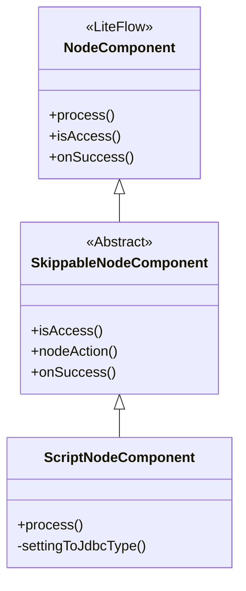
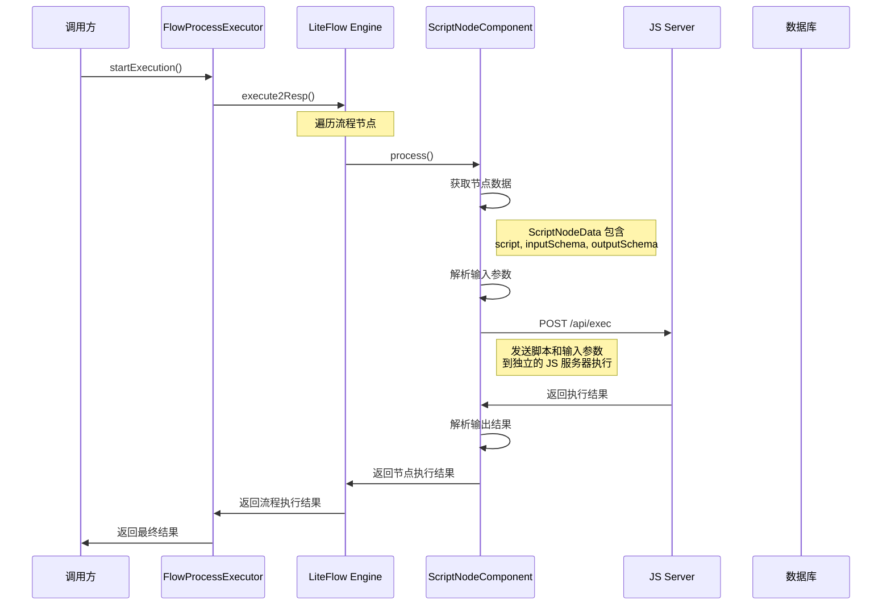

# ScriptNodeComponent 注册机制分析

## 概述

`ScriptNodeComponent` 是 Flow 模块中用于执行 JavaScript 脚本的节点组件，它通过 LiteFlow 框架的 `@LiteflowComponent` 注解注册，并与连接器（Connector）系统配合工作，实现动态脚本执行。

## 1. 组件注册机制

### 1.1 LiteFlow 组件注册

```java
@Slf4j
@Setter
@LiteflowComponent("javascript")  // 关键注解：注册为 LiteFlow 组件
public class ScriptNodeComponent extends SkippableNodeComponent {
    // ...
}
```

**注册机制说明**：
- `@LiteflowComponent("javascript")` 注解将 `ScriptNodeComponent` 注册到 LiteFlow 容器中
- `"javascript"` 是组件的名称，在流程定义中通过这个名称引用该组件
- LiteFlow 在启动时会扫描所有带有 `@LiteflowComponent` 注解的类并自动注册

### 1.2 组件继承关系



**继承关系说明**：
- `ScriptNodeComponent` 继承自 `SkippableNodeComponent`
- `SkippableNodeComponent` 继承自 LiteFlow 的 `NodeComponent`
- 通过继承获得 LiteFlow 的节点执行能力

## 2. 连接器（Connector）与脚本组件的关联

### 2.1 连接器数据模型

```java
// FlowConnectorScriptDO - 连接器脚本数据表
@Table(value = "flow_connector_script")
public class FlowConnectorScriptDO extends BaseAppEntity {
    private String scriptUuid;      // 脚本 UUID
    private String connectorUuid;   // 连接器 UUID
    private String scriptName;      // 脚本名称
    private String scriptType;      // 脚本类型
    private String rawScript;       // 原始脚本内容
    private String inputParameter;   // 输入参数定义
    private String outputParameter;  // 输出参数定义
    private String inputSchema;      // 输入参数模式
    private String outputSchema;     // 输出参数模式
}
```

### 2.2 流程图构建时的数据关联

在 [`FlowGraphBuilder.traverseNodeAndEnrichData()`](onebase-module-flow/onebase-module-flow-core/src/main/java/com/cmsr/onebase/module/flow/core/graph/FlowGraphBuilder.java:80) 方法中：

```java
private void traverseNodeAndEnrichData(Long applicationId, JsonGraphNode node) {
    if (node.getData() instanceof ScriptNodeData scriptNodeData) {
        // 根据脚本数据从数据库加载脚本内容
        FlowConnectorScriptDO connectorScriptDO = TenantManager.withoutTenantCondition(() -> 
            connectorScriptRepository.findByApplicationAndUuid(
                applicationId, 
                scriptNodeData.getActionId(), 
                scriptNodeData.getActionUuid()
            )
        );
        
        // 将脚本内容设置到节点数据中
        scriptNodeData.setScript(connectorScriptDO.getRawScript());
        scriptNodeData.setInputSchema(connectorScriptDO.getInputSchema());
        scriptNodeData.setOutputSchema(connectorScriptDO.getOutputSchema());
    }
    // 递归处理子节点
    if (CollectionUtils.isNotEmpty(node.getBlocks())) {
        for (JsonGraphNode childNode : node.getBlocks()) {
            traverseNodeAndEnrichData(applicationId, childNode);
        }
    }
}
```

**数据关联流程**：
1. 流程定义中包含 `ScriptNodeData`，包含 `actionId` 和 `actionUuid`
2. 流程图构建时，根据 `actionId` 和 `actionUuid` 从 `flow_connector_script` 表查询脚本内容
3. 将查询到的脚本内容、输入输出模式等数据设置到 `ScriptNodeData` 中

## 3. 脚本执行流程

### 3.1 完整执行流程



### 3.2 脚本执行详细代码分析

在 [`ScriptNodeComponent.process()`](onebase-module-flow/onebase-module-flow-component/src/main/java/com/cmsr/onebase/module/flow/component/external/ScriptNodeComponent.java:47) 方法中：

```java
@Override
public void process() throws Exception {
    // 1. 初始化上下文
    ExecuteContext executeContext = this.getContextBean(ExecuteContext.class);
    executeContext.addLog("脚本节点开始执行");
    VariableContext variableContext = this.getContextBean(VariableContext.class);
    ScriptNodeData nodeData = (ScriptNodeData) executeContext.getNodeData(this.getTag());
    InLoopDepth inLoopDepth = nodeData.getInLoopDepth();
    Map<String, Object> expressionContext = VariableProvider.resolveLoopVariables(this, inLoopDepth, variableContext.getNodeVariables());

    // 2. 从空间中读取变量
    List<ConditionItem> conditionItems = nodeData.getInputParameterFields();
    settingToJdbcType(conditionItems);
    List<ExpressionItem> expressionItems = flowConditionsProvider.formatConditionItemsForValue(conditionItems, expressionContext);

    Map<String, Object> inputData = expressionItems.stream().collect(Collectors.toMap(ExpressionItem::getFieldKey, ExpressionItem::getFieldValue));
    
    // 3. 执行Http调用
    JsRequest jsRequest = new JsRequest();
    jsRequest.setScript(nodeData.getScript());  // 从节点数据获取脚本内容
    List<PropertyDefine> inputDef = JsonUtils.parseArray(nodeData.getInputSchema(), PropertyDefine.class);
    Map<String, Object> parsedInputParams = SchemaParser.parseBySchemaDef(inputData, inputDef);
    jsRequest.setInputJson(JsonUtils.toJsonString(parsedInputParams));

    String invokeUrl = jsServerAddress + INVOKE_SUFFIX_URI;
    HttpResponse<JsonNode> nodeHttpResponse = Unirest.post(invokeUrl)
            .contentType(ContentType.APPLICATION_JSON)
            .version(HttpClient.Version.HTTP_1_1)
            .body(jsRequest)
            .asJson();

    if (nodeHttpResponse.isSuccess()) {
        JSONObject result = nodeHttpResponse.getBody().getObject().getJSONObject("data");
        List<PropertyDefine> outputDef = JsonUtils.parseArray(nodeData.getOutputSchema(), PropertyDefine.class);
        Map<String, Object> resultMap = result.toMap();
        Map<String, Object> parsedResult = SchemaParser.parseBySchemaDef(resultMap, outputDef);
        executeContext.addLog("脚本节点执行成功，输出: " + JsonUtils.toJsonString(parsedResult));
        variableContext.putNodeVariables(this.getTag(), parsedResult);
    } else {
        int httpStatus = nodeHttpResponse.getStatus();
        String errMsg = nodeHttpResponse.getBody().getObject().getString("msg");
        executeContext.addLog("脚本节点执行失败, 响应码: " + httpStatus + ", 异常信息: " + errMsg);
        throw new RuntimeException("脚本节点执行失败");
    }
}
```

**执行步骤说明**：
1. **初始化上下文**：获取执行上下文、变量上下文和节点数据
2. **解析输入参数**：从变量上下文中提取节点所需的输入参数
3. **构建请求**：将脚本内容和输入参数构建为 JsRequest 对象
4. **HTTP 调用**：向独立的 JavaScript 服务器发送执行请求
5. **处理结果**：解析执行结果并设置到变量上下文中

## 4. 连接器管理接口

### 4.1 连接器脚本管理

通过 [`FlowConnectorController`](onebase-module-flow/onebase-module-flow-build/src/main/java/com/cmsr/onebase/module/flow/build/controller/FlowConnectorController.java) 提供连接器脚本的管理接口：

```java
// 创建连接器脚本
@PostMapping("/create")
public CommonResult<Long> createConnectorBrief(@RequestBody @Valid CreateFlowConnectorReqVO createVO) {
    Long connectorId = connectorService.createConnector(createVO);
    return CommonResult.success(connectorId);
}

// 更新连接器脚本
@PostMapping("/update")
public CommonResult<Boolean> updateConnector(@RequestBody @Valid UpdateFlowConnectorReqVO updateVO) {
    connectorService.updateConnector(updateVO);
    return CommonResult.success(Boolean.TRUE);
}

// 删除连接器脚本
@PostMapping("/delete")
public CommonResult<Boolean> deleteConnector(@RequestParam("id") Long connectorId) {
    connectorService.deleteById(connectorId);
    return CommonResult.success(Boolean.TRUE);
}
```

### 4.2 脚本内容管理

通过 [`FlowConnectorScriptServiceImpl`](onebase-module-flow/onebase-module-flow-build/src/main/java/com/cmsr/onebase/module/flow/build/service/FlowConnectorScriptServiceImpl.java) 管理脚本内容：

```java
// 创建脚本
@Override
public Long createConnectorScript(CreateFlowConnectorScriptReqVO createVO) {
    FlowConnectorScriptDO connectorScriptDO = BeanUtils.toBean(createVO, FlowConnectorScriptDO.class);
    
    // 关联连接器
    FlowConnectorDO connectorDO = connectorRepository.getById(createVO.getConnectorId());
    connectorScriptDO.setScriptUuid(UuidUtils.getUuid());
    connectorScriptDO.setConnectorUuid(connectorDO.getConnectorUuid());
    connectorScriptDO.setApplicationId(connectorDO.getApplicationId());
    
    // 保存脚本内容
    connectorScriptDO.setInputParameter(jsonNodeToString(createVO.getInputParameter()));
    connectorScriptDO.setOutputParameter(jsonNodeToString(createVO.getOutputParameter()));
    connectorScriptDO.setInputSchema(jsonNodeToString(createVO.getInputSchema()));
    connectorScriptDO.setOutputSchema(jsonNodeToString(createVO.getOutputSchema()));
    connectorScriptDO.setRawScript(createVO.getRawScript());
    
    connectorScriptRepository.save(connectorScriptDO);
    return connectorScriptDO.getId();
}
```

## 5. 配置与部署

### 5.1 JavaScript 服务器配置

```yaml
# application.yml
liteflow:
  js-server-address: http://localhost:3000  # JavaScript 服务器地址
```

### 5.2 组件启用条件

通过 [`FlowEnableCondition`](onebase-module-flow/onebase-module-flow-core/src/main/java/com/cmsr/onebase/module/flow/core/config/FlowEnableCondition.java) 控制组件的启用：

```java
@Override
public boolean matches(ConditionContext context, AnnotatedTypeMetadata metadata) {
    Environment environment = context.getEnvironment();
    if (environment.getProperty("liteflow.enable", Boolean.class, false)) {
        log.debug("liteflow.enable=true, 启用流程运行环境");
        return true;
    } else {
        return false;
    }
}
```

## 6. 关键设计要点

### 6.1 安全性考虑

1. **脚本隔离**：脚本在独立的 JavaScript 服务器中执行，与主应用隔离
2. **参数校验**：通过 Schema 定义对输入输出参数进行严格校验
3. **权限控制**：连接器脚本与应用级别关联，实现租户隔离

### 6.2 性能优化

1. **异步执行**：HTTP 调用是异步的，不会阻塞主流程
2. **缓存机制**：流程定义和脚本内容在缓存中，减少数据库查询
3. **连接池**：Unirest 使用连接池管理 HTTP 连接

### 6.3 扩展性设计

1. **多语言支持**：通过修改 `@LiteflowComponent` 名称和服务器地址，支持其他脚本语言
2. **版本管理**：连接器脚本支持版本控制，便于升级和回滚
3. **插件化**：连接器系统可以独立扩展，不影响核心流程引擎

## 7. 总结

`ScriptNodeComponent` 的注册机制是一个典型的**注解驱动 + 数据关联**的设计：

1. **注册阶段**：通过 `@LiteflowComponent("javascript")` 注解将组件注册到 LiteFlow 容器
2. **关联阶段**：流程图构建时，根据节点数据中的 `actionId` 和 `actionUuid` 从数据库加载脚本内容
3. **执行阶段**：组件从节点数据获取脚本内容，通过 HTTP 调用执行脚本并处理结果

这种设计实现了**动态脚本执行**的能力，同时保持了良好的安全性和扩展性。脚本内容可以独立管理和更新，而不需要重新部署主应用。