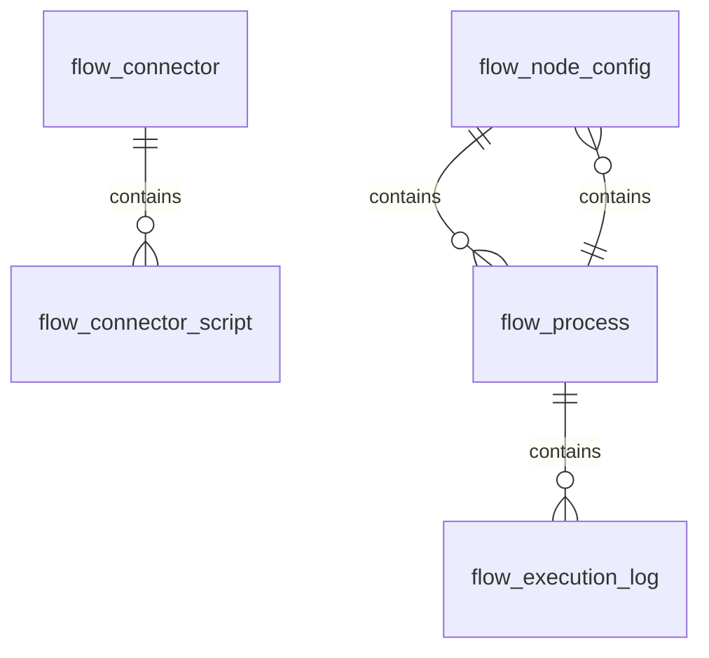
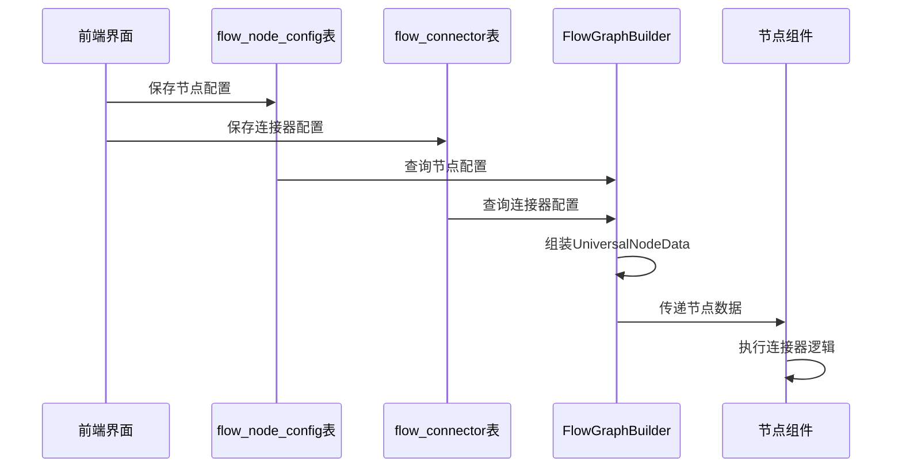
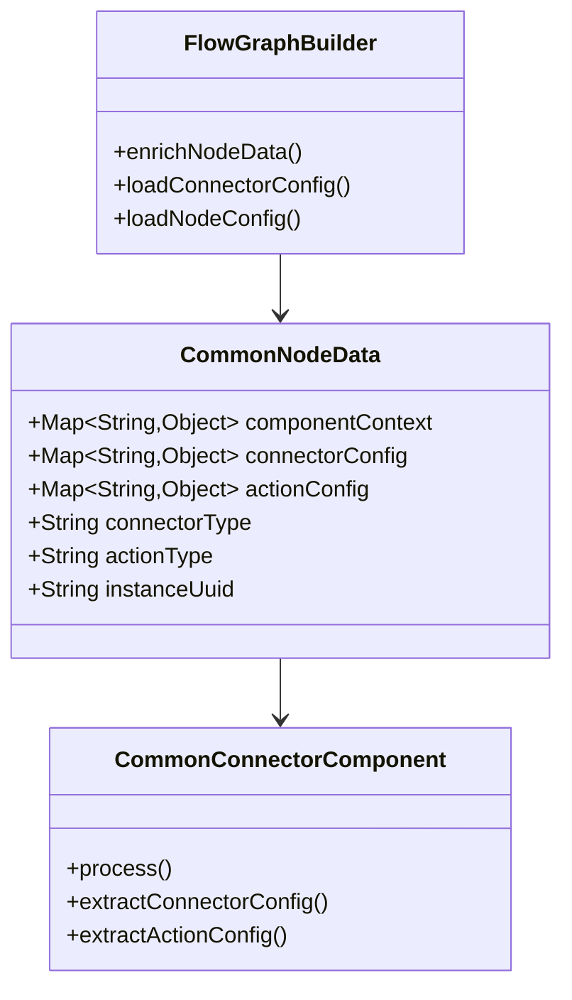

# OneBase Flow 通用连接器开发方案

## 目录
1. [现有架构深度分析](#1-现有架构深度分析)
2. [通用连接器数据模型设计](#2-通用连接器数据模型设计)
3. [基于双Map的连接器架构](#3-基于双map的连接器架构)
4. [163邮箱连接器实现示例](#4-163邮箱连接器实现示例)
5. [通用连接器开发框架](#5-通用连接器开发框架)
6. [实施步骤](#6-实施步骤)

---

## 1. 现有架构深度分析

### 1.1 数据库表结构分析



**关键表说明**：

#### 1.1.1 flow_connector 表（连接器定义）
```java
// FlowConnectorDO - 连接器基础信息
private String connectorUuid;      // 连接器UUID
private String connectorName;      // 连接器名称
private String typeCode;          // 连接器类型编码
private String description;         // 描述
private String config;             // 连接器配置（JSON）
```

#### 1.1.2 flow_connector_script 表（连接器脚本）
```java
// FlowConnectorScriptDO - 连接器脚本详情
private String scriptUuid;         // 脚本UUID
private String connectorUuid;       // 连接器UUID
private String scriptName;         // 脚本名称
private String scriptType;         // 脚本类型
private String rawScript;          // 原始脚本内容
private String inputParameter;      // 输入参数（JSON）
private String outputParameter;     // 输出参数（JSON）
private String inputSchema;         // 输入参数模式（JSON）
private String outputSchema;        // 输出参数模式（JSON）
```

#### 1.1.3 flow_node_config 表（节点配置）
```java
// FlowNodeConfigDO - 节点配置信息
private String level1Code;         // 分类编码1
private String level2Code;         // 分类编码2
private String level3Code;         // 分类编码3
private String nodeName;            // 节点名称
private String nodeCode;            // 节点编码（唯一）
private String simpleRemark;        // 简单描述
private String detailDescription;   // 详细描述
private Integer activeStatus;       // 启用状态
private String defaultProperties;  // 默认参数（JSON）
private String connConfigType;     // 连接器配置类型
private String connConfig;         // 连接器配置（JSON）
private String actionConfigType;    // 动作配置类型
private String actionConfig;        // 动作配置（JSON）
private Integer sortOrder;          // 排序
```

### 1.2 现有连接器架构分析

#### 1.2.1 ScriptNodeData 的问题
```java
@NodeType("javascript")
public class ScriptNodeData extends NodeData {
    private String script;                    // 从 flow_connector_script 补充
    private String instanceUuid;               // 实例UUID
    private Long actionId;                    // 临时兼容策略
    private String actionUuid;                  // 动作UUID
    private List<ConditionItem> inputParameterFields;  // 输入参数字段
    private String outputParameter;             // 输出参数
    private String inputSchema;                 // 输入参数模式
    private String outputSchema;                // 输出参数模式
}
```

**问题分析**：
- **强耦合**：ScriptNodeData 与 JavaScript 连接器强绑定
- **数据混合**：节点数据 + 连接器脚本数据混合在一个类中
- **扩展困难**：新增连接器类型需要修改节点数据类

---

## 2. 通用连接器数据模型设计

### 2.1 设计原则

基于你的思路，设计更通用的连接器架构：

1. **分离关注点**：节点配置 vs 连接器配置
2. **双Map存储**：flow_node_config 存储组件上下文，flow_connector 存储连接器定义
3. **动态组装**：在 FlowGraphBuilder 中拼装完整的节点数据
4. **类型无关**：节点数据类不依赖具体的连接器类型

### 2.2 通用节点数据模型

```java
@NodeType("common")
public class CommonNodeData extends NodeData implements Serializable {
    
    /**
     * 组件上下文信息（来自 flow_node_config.connConfig）
     */
    private Map<String, Object> componentContext;
    
    /**
     * 连接器配置信息（来自 flow_connector.config）
     */
    private Map<String, Object> connectorConfig;
    
    /**
     * 动作配置信息（来自 flow_node_config.actionConfig）
     */
    private Map<String, Object> actionConfig;
    
    /**
     * 连接器类型
     */
    private String connectorType;
    
    /**
     * 动作类型
     */
    private String actionType;
    
    /**
     * 节点实例ID
     */
    private String instanceUuid;
}
```

### 2.3 数据流转设计



---

## 3. 基于双Map的连接器架构

### 3.1 核心设计思想



### 3.2 数据加载流程

#### 3.2.1 FlowGraphBuilder 增强

```java
private void traverseNodeAndEnrichData(Long applicationId, JsonGraphNode node) {
    if (node.getData() instanceof CommonNodeData nodeData) {
        // 1. 加载节点配置（从 flow_node_config）
        Map<String, Object> componentContext = loadNodeConfig(nodeData.getNodeCode());
        
        // 2. 加载连接器配置（从 flow_connector）
        Map<String, Object> connectorConfig = loadConnectorConfig(nodeData.getConnectorType());
        
        // 3. 加载动作配置（从 flow_node_config.actionConfig）
        Map<String, Object> actionConfig = loadActionConfig(nodeData.getActionType());
        
        // 4. 设置到节点数据
        nodeData.setComponentContext(componentContext);
        nodeData.setConnectorConfig(connectorConfig);
        nodeData.setActionConfig(actionConfig);
    }
    
    // 递归处理子节点
}

private Map<String, Object> loadNodeConfig(String nodeCode) {
    FlowNodeConfigDO configDO = nodeConfigRepository.findByNodeCode(nodeCode);
    return parseJsonToMap(configDO.getConnConfig());
}

private Map<String, Object> loadConnectorConfig(String connectorType) {
    FlowConnectorDO connectorDO = connectorRepository.findByTypeCode(connectorType);
    return parseJsonToMap(connectorDO.getConfig());
}
```

### 3.3 通用连接器组件

```java
@LiteflowComponent("common")
public class CommonConnectorComponent extends SkippableNodeComponent {

    @Override
    public void process() throws Exception {
        // 1. 获取节点数据
        ExecuteContext executeContext = this.getContextBean(ExecuteContext.class);
        UniversalNodeData nodeData = (UniversalNodeData) executeContext.getNodeData(this.getTag());
        
        // 2. 提取配置信息
        Map<String, Object> connectorConfig = nodeData.getConnectorConfig();
        Map<String, Object> actionConfig = nodeData.getActionConfig();
        
        // 3. 根据连接器类型执行相应逻辑
        String connectorType = nodeData.getConnectorType();
        switch (connectorType) {
            case "EMAIL_163":
                executeEmail163(connectorConfig, actionConfig);
                break;
            case "SMS_ALI":
                executeSmsAli(connectorConfig, actionConfig);
                break;
            case "DATABASE_MYSQL":
                executeDatabaseMysql(connectorConfig, actionConfig);
                break;
            default:
                throw new UnsupportedOperationException("不支持的连接器类型: " + connectorType);
        }
    }
    
    private void executeEmail163(Map<String, Object> connectorConfig, Map<String, Object> actionConfig) {
        // 实现163邮箱发送逻辑
        String smtpHost = (String) connectorConfig.get("smtpHost");
        Integer smtpPort = (Integer) connectorConfig.get("smtpPort");
        // ... 邮箱发送逻辑
    }
    
    private void executeSmsAli(Map<String, Object> connectorConfig, Map<String, Object> actionConfig) {
        // 实现阿里云短信发送逻辑
        String accessKey = (String) connectorConfig.get("accessKey");
        String secretKey = (String) connectorConfig.get("secretKey");
        // ... 短信发送逻辑
    }
    
    private void executeDatabaseMysql(Map<String, Object> connectorConfig, Map<String, Object> actionConfig) {
        // 实现MySQL数据库操作逻辑
        String jdbcUrl = (String) connectorConfig.get("jdbcUrl");
        String username = (String) connectorConfig.get("jdbcUsername");
        // ... 数据库操作逻辑
    }
}
```

---

## 4. 163邮箱连接器实现示例

### 4.1 数据库配置

#### 4.1.1 flow_connector 表记录
```sql
INSERT INTO flow_connector (connector_uuid, connector_name, type_code, description, config) VALUES 
('uuid-163-email', '163邮箱连接器', 'EMAIL_163', '163邮箱发送连接器', '{
  "smtpHost": "smtp.163.com",
  "smtpPort": 465,
  "useSSL": true,
  "timeout": 30000,
  "maxRetries": 3
}');
```

#### 4.1.2 flow_node_config 表记录
```sql
INSERT INTO flow_node_config (level1_code, level2_code, level3_code, node_name, node_code, simple_remark, detail_description, active_status, default_properties, conn_config_type, conn_config, action_config_type, action_config, sort_order) VALUES 
('CONNECTOR', 'EMAIL', '163', '163邮箱发送', 'EMAIL_163_SEND', '163邮箱发送节点', '用于发送163邮件', '支持文本和HTML邮件发送', 1, '{
  "to": ["user@example.com"],
  "subject": "测试邮件",
  "content": "这是一封测试邮件"
}', 'EMAIL', '{
  "smtpHost": "smtp.163.com",
  "smtpPort": 465,
  "useSSL": true
}', 'EMAIL_SEND', '{
  "templateType": "TEXT",
  "charset": "UTF-8"
}', 100);
```

### 4.2 流程定义示例

```json
{
  "nodes": [
    {
      "id": "node1",
      "type": "universal",
      "data": {
        "connectorType": "EMAIL_163",
        "actionType": "EMAIL_SEND",
        "instanceUuid": "uuid-instance-001"
      }
    }
  ]
}
```

### 4.3 执行时数据结构

在 `UniversalConnectorComponent.process()` 中：

```java
// connectorConfig 来自 flow_connector.config
Map<String, Object> connectorConfig = nodeData.getConnectorConfig();
// {
//   "smtpHost": "smtp.163.com",
//   "smtpPort": 465,
//   "useSSL": true,
//   "timeout": 30000,
//   "maxRetries": 3
// }

// actionConfig 来自 flow_node_config.actionConfig
Map<String, Object> actionConfig = nodeData.getActionConfig();
// {
//   "templateType": "TEXT",
//   "charset": "UTF-8"
// }

// componentContext 来自 flow_node_config.connConfig
Map<String, Object> componentContext = nodeData.getComponentContext();
// {
//   "to": ["user@example.com"],
//   "subject": "测试邮件",
//   "content": "这是一封测试邮件"
// }
```

---

## 5. 通用连接器开发框架

### 5.1 连接器接口定义

```java
public interface ConnectorExecutor {
    void execute(Map<String, Object> connectorConfig, 
                 Map<String, Object> actionConfig, 
                 Map<String, Object> componentContext) throws Exception;
    
    String getConnectorType();
    
    boolean validateConfig(Map<String, Object> config);
}
```

### 5.2 连接器工厂

```java
@Component
public class ConnectorFactory {
    
    private Map<String, ConnectorExecutor> connectorExecutors = new HashMap<>();
    
    @Autowired
    private ApplicationContext applicationContext;
    
    @PostConstruct
    public void init() {
        // 自动注册所有连接器实现
        Map<String, ConnectorExecutor> beans = 
            applicationContext.getBeansOfType(ConnectorExecutor.class);
        
        for (ConnectorExecutor executor : beans.values()) {
            connectorExecutors.put(executor.getConnectorType(), executor);
        }
    }
    
    public ConnectorExecutor getConnector(String connectorType) {
        return connectorExecutors.get(connectorType);
    }
}
```

### 5.3 具体连接器实现

```java
@Component
public class Email163Connector implements ConnectorExecutor {
    
    @Override
    public String getConnectorType() {
        return "EMAIL_163";
    }
    
    @Override
    public void execute(Map<String, Object> connectorConfig, 
                      Map<String, Object> actionConfig, 
                      Map<String, Object> componentContext) throws Exception {
        
        // 1. 验证配置
        if (!validateConfig(connectorConfig)) {
            throw new IllegalArgumentException("163邮箱连接器配置无效");
        }
        
        // 2. 提取参数
        Email163Request request = buildRequest(actionConfig, componentContext);
        
        // 3. 发送邮件
        Email163Response response = sendEmail(connectorConfig, request);
        
        // 4. 处理结果
        handleResponse(response);
    }
    
    @Override
    public boolean validateConfig(Map<String, Object> config) {
        return config.containsKey("smtpHost") && 
               config.containsKey("smtpPort") && 
               config.containsKey("useSSL");
    }
    
    private Email163Request buildRequest(Map<String, Object> actionConfig, 
                                      Map<String, Object> componentContext) {
        Email163Request request = new Email163Request();
        
        // 从 actionConfig 获取动作参数
        request.setTemplateType((String) actionConfig.get("templateType"));
        request.setCharset((String) actionConfig.get("charset"));
        
        // 从 componentContext 获取组件参数
        request.setTo((List<String>) componentContext.get("to"));
        request.setSubject((String) componentContext.get("subject"));
        request.setContent((String) componentContext.get("content"));
        
        return request;
    }
}
```

### 5.4 通用组件简化

```java
@LiteflowComponent("common")
public class CommonConnectorComponent extends SkippableNodeComponent {
    
    @Autowired
    private ConnectorFactory connectorFactory;
    
    @Override
    public void process() throws Exception {
        // 1. 获取节点数据
        CommonNodeData nodeData = (CommonNodeData) getContextBean(ExecuteContext.class).getNodeData(this.getTag());
        
        // 2. 获取连接器执行器
        ConnectorExecutor executor = connectorFactory.getConnector(nodeData.getConnectorType());
        
        // 3. 执行连接器逻辑
        executor.execute(nodeData.getConnectorConfig(), 
                     nodeData.getActionConfig(), 
                     nodeData.getComponentContext());
        
        // 4. 记录执行日志
        getContextBean(ExecuteContext.class).addLog(
            String.format("执行 %s 连接器成功", nodeData.getConnectorType()));
    }
}
```

---

## 6. 实施步骤

### 6.1 第一阶段：数据模型重构（2-3天）

#### 6.1.1 创建通用节点数据模型
- 创建 `CommonNodeData` 类（放在 onebase-module-flow-context 模块）
- 创建 `ConnectorExecutor` 接口（放在 onebase-module-flow-core 模块）
- 创建 `ConnectorFactory` 工厂类（放在 onebase-module-flow-core 模块）

#### 6.1.2 重构 FlowGraphBuilder
- 修改 `traverseNodeAndEnrichData()` 方法
- 实现双Map数据加载逻辑
- 保持向后兼容性

#### 6.1.3 数据库初始化
- 创建 flow_connector 记录
- 创建 flow_node_config 记录
- 编写数据迁移脚本

### 6.2 第二阶段：连接器实现（3-4天）

#### 6.2.1 163邮箱连接器
- 实现 `Email163Connector` 类
- 实现 SMTP 邮件发送逻辑
- 实现配置验证和错误处理

#### 6.2.2 短信连接器
- 实现 `SmsAliConnector` 类
- 集成阿里云短信 SDK
- 实现短信模板和发送逻辑

#### 6.2.3 数据库连接器
- 实现 `DatabaseMysqlConnector` 类
- 实现 JDBC 数据库操作
- 实现 SQL 模板和执行逻辑

### 6.3 第三阶段：管理界面（2-3天）

#### 6.3.1 连接器管理界面
- 扩展连接器 CRUD 接口
- 实现连接器配置界面
- 实现连接器测试功能

#### 6.3.2 节点配置界面
- 扩展节点配置接口
- 实现可视化配置编辑器
- 实现配置模板管理

#### 6.3.3 流程编辑器集成
- 在流程编辑器中支持通用节点
- 实现连接器类型选择
- 实现参数配置界面

### 6.4 第四阶段：测试和优化（1-2天）

#### 6.4.1 单元测试
- 编写连接器单元测试
- 编写数据加载测试
- 编写集成测试

#### 6.4.2 性能优化
- 连接器实例池化
- 配置缓存机制
- 异步执行优化

---

## 7. 优势分析

### 7.1 相比现有架构的优势

| 方面 | 现有架构 | 通用架构 |
|------|----------|----------|
| **扩展性** | 需要修改节点数据类 | 只需新增连接器实现 |
| **维护性** | 节点和连接器耦合 | 职责分离，易于维护 |
| **配置灵活性** | 配置固定在代码中 | 配置可动态管理 |
| **类型安全性** | 强类型依赖 | 类型无关，运行时确定 |
| **测试友好** | 需要完整流程测试 | 可单独测试连接器 |

### 7.2 技术优势

1. **松耦合**：节点组件与连接器实现完全解耦
2. **高内聚**：每个连接器专注于自己的业务逻辑
3. **易扩展**：新增连接器类型无需修改核心代码
4. **配置化**：所有配置都可以通过数据库管理
5. **可测试**：每个连接器都可以独立测试

---

## 8. 风险控制

### 8.1 技术风险

| 风险 | 影响 | 应对措施 |
|------|------|----------|
| 配置复杂性 | 中 | 提供配置模板和验证机制 |
| 性能开销 | 低 | 实现配置缓存和连接器池 |
| 类型安全 | 低 | 运行时类型检查和异常处理 |
| 向后兼容 | 中 | 保持现有接口，渐进式迁移 |

### 8.2 实施风险

| 风险 | 影响 | 应对措施 |
|------|------|----------|
| 数据迁移 | 高 | 编写详细的迁移脚本和回滚方案 |
| 学习成本 | 中 | 提供详细文档和培训 |
| 开发周期 | 中 | 分阶段实施，优先核心功能 |
| 质量控制 | 中 | 建立完善的测试体系 |

---

## 总结

本方案基于你的双Map思路，设计了一个更加通用和灵活的连接器架构：

1. **分离关注点**：通过 flow_node_config 和 flow_connector 两个表分别管理节点配置和连接器定义
2. **动态组装**：在 FlowGraphBuilder 中动态组装 CommonNodeData
3. **类型无关**：节点组件不依赖具体连接器类型，通过工厂模式运行时确定
4. **易于扩展**：新增连接器只需实现 ConnectorExecutor 接口，无需修改核心代码

这个架构相比现有的 ScriptNodeData 方案，具有更好的扩展性、维护性和测试友好性，为后续添加邮箱、短信、数据库等各种连接器类型奠定了坚实的基础。